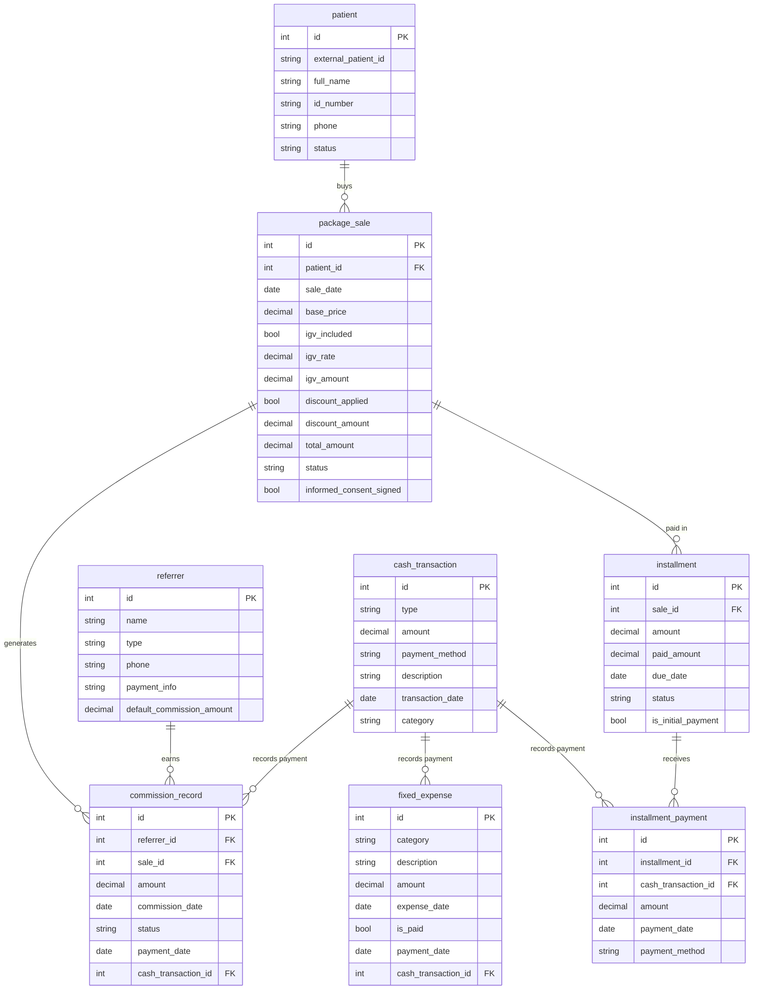

# Base de datos payment-service: payments_db



## Estructura general del sistema

Esta base de datos modela la operación de un negocio de salud que:

1. Registra y vincula pacientes con el sistema clínico externo.
2. Registra la venta de paquetes de tratamiento.
3. Permite que los paquetes se paguen mediante cuotas.
4. Registra cada pago realizado sobre una cuota.
5. Gestiona referidores que generan comisiones.
6. Lleva un control centralizado de los movimientos de dinero mediante `cash_transaction`.
7. Administra los gastos fijos y sus respectivos pagos.

El flujo de pagos se divide en dos niveles: `installment` representa la obligación o cuota dentro de una venta, mientras que `installment_payment` registra cada pago realizado sobre dicha cuota. Este último se vincula con `cash_transaction`, permitiendo relacionar cada ingreso con el movimiento correspondiente de caja.

De esta manera, la estructura mantiene separada la deuda de la venta de los movimientos reales de dinero y permite registrar pagos parciales o múltiples pagos sobre una misma cuota.

---

## Explicación de cada tabla

### `patient` (Paciente)

Representa el registro del paciente utilizado por el módulo de Payments para asociar sus operaciones comerciales.

* `external_patient_id`: identificador del paciente en InnovaByte. Permite vincular ambos sistemas sin depender del identificador interno de Payments.
* `full_name`: nombre completo del paciente.
* `id_number`: número de documento de identidad.
* `phone`: número telefónico, cuando esté disponible.
* `status`: estado del paciente, por ejemplo activo o inactivo.

La información maestra del paciente pertenece a InnovaByte, mientras que Payments conserva los datos necesarios para realizar sus operaciones y mantener la referencia al sistema clínico.

### `package_sale` (Venta de Paquete)

Representa la venta de un paquete de tratamiento a un paciente.

* `base_price`: precio base de la venta.
* `igv_included`: indica si el precio base incluye IGV.
* `igv_rate`: tasa de IGV aplicada.
* `igv_amount`: monto calculado correspondiente al IGV.
* `discount_applied`: indica si se aplicó un descuento.
* `discount_amount`: monto del descuento aplicado.
* `total_amount`: monto final que corresponde pagar.
* `status`: estado de la venta, por ejemplo pendiente, pagado o anulado.
* `informed_consent_signed`: indica si el consentimiento informado correspondiente ha sido firmado.

La venta constituye la operación comercial principal y puede tener una o varias cuotas asociadas.

### `installment` (Cuota)

Representa una obligación de pago asociada a una venta.

* `amount`: monto total de la cuota.
* `paid_amount`: monto acumulado que ha sido pagado de la cuota.
* `due_date`: fecha de vencimiento.
* `status`: estado de la cuota, por ejemplo pendiente, pagada, vencida o anulada.
* `is_initial_payment`: indica si corresponde al pago inicial de la venta.

Una cuota no representa directamente un movimiento de caja. Los pagos realizados sobre ella se registran mediante `installment_payment`.

### `installment_payment` (Pago de Cuota)

Registra cada pago realizado sobre una cuota.

* `installment_id`: cuota a la que corresponde el pago.
* `cash_transaction_id`: movimiento de caja generado por el pago.
* `amount`: monto efectivamente pagado.
* `payment_date`: fecha en que se realizó el pago.
* `payment_method`: medio utilizado para realizar el pago.

Esta tabla permite registrar pagos parciales y múltiples pagos sobre una misma cuota, manteniendo separada la obligación de pago del movimiento real de dinero.

### `referrer` (Referidor)

Representa a las personas o entidades que refieren pacientes al negocio y pueden recibir una comisión.

* `type`: clasifica el tipo de referidor, por ejemplo `Promotor Externo` o `Médico Traumatólogo`.
* `payment_info`: información necesaria para realizar el pago de la comisión.
* `default_commission_amount`: monto de comisión establecido como valor por defecto.

### `commission_record` (Registro de Comisión)

Representa una comisión generada a favor de un referidor.

* `referrer_id`: referidor que recibe la comisión.
* `sale_id`: venta que originó la comisión.
* `amount`: monto de la comisión.
* `commission_date`: fecha en que se registra la comisión.
* `status`: estado de la comisión, por ejemplo pendiente, pagada o anulada.
* `payment_date`: fecha en que se realizó el pago.
* `cash_transaction_id`: movimiento de caja asociado al pago de la comisión.

Una venta puede generar cero o varios registros de comisión, dependiendo de las reglas del negocio.

### `cash_transaction` (Transacción de Caja)

Es el registro central de los movimientos de dinero del sistema.

* `type`: tipo de movimiento, ingreso o egreso.
* `amount`: monto de la operación.
* `payment_method`: medio mediante el cual se realizó el movimiento.
* `description`: descripción del movimiento.
* `transaction_date`: fecha de la operación.
* `category`: categoría utilizada para clasificar el movimiento.

Los pagos de cuotas, pagos de comisiones y pagos de gastos se registran como movimientos de caja cuando efectivamente ocurre el movimiento de dinero.

### `fixed_expense` (Gasto Fijo)

Representa gastos recurrentes del negocio, como alquiler, honorarios, salarios administrativos o servicios externos.

* `category`: categoría del gasto.
* `description`: descripción del gasto.
* `amount`: monto correspondiente.
* `expense_date`: fecha asociada al gasto.
* `is_paid`: indica si el gasto ya fue pagado.
* `payment_date`: fecha en que se realizó el pago.
* `cash_transaction_id`: movimiento de caja asociado al pago.

El gasto puede existir como obligación pendiente y solamente cuando se realiza el pago se registra el movimiento correspondiente en `cash_transaction`.

---

## Explicación de las relaciones

1. **`patient ||--o{ package_sale`**: un paciente puede tener múltiples ventas de paquetes y cada venta pertenece a un solo paciente.

2. **`package_sale ||--o{ installment`**: una venta puede dividirse en una o varias cuotas. Cada cuota pertenece a una única venta.

3. **`installment ||--o{ installment_payment`**: una cuota puede recibir uno o varios pagos, permitiendo pagos parciales o pagos realizados en diferentes momentos.

4. **`cash_transaction ||--o{ installment_payment`**: un movimiento de caja puede estar asociado a uno o varios pagos de cuotas, según cómo se registre una operación de cobro.

5. **`referrer ||--o{ commission_record`**: un referidor puede tener múltiples registros de comisión.

6. **`package_sale ||--o{ commission_record`**: una venta puede generar cero o varios registros de comisión, dependiendo de las reglas de negocio y los referidores involucrados.

7. **`cash_transaction ||--o{ commission_record`**: cuando una comisión es pagada, el movimiento de dinero correspondiente queda registrado en la caja.

8. **`cash_transaction ||--o{ fixed_expense`**: cuando un gasto fijo es pagado, su salida de dinero queda registrada en la caja.

El flujo principal de pagos queda:

`patient → package_sale → installment → installment_payment → cash_transaction`

Mientras que las comisiones siguen:

`referrer → commission_record → cash_transaction`

Y los gastos:

`fixed_expense → cash_transaction`

De este modo, `installment` representa la deuda u obligación de pago, mientras que `installment_payment` representa el pago efectivamente realizado. `cash_transaction` concentra los movimientos reales de dinero y permite realizar el control y cierre de caja.

```

Esta versión ya corrige el punto más importante del modelo anterior: **`installment` ya no apunta directamente a `cash_transaction`**. El movimiento real pasa por `installment_payment`, que es lo que permite manejar correctamente pagos parciales y múltiples pagos de una misma cuota.
```
