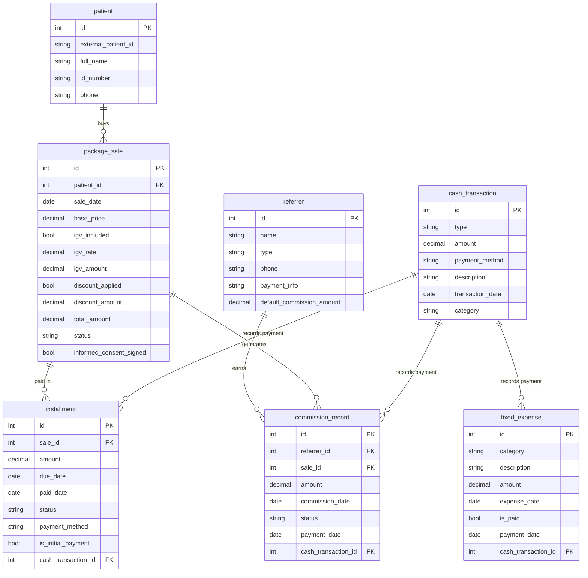

# Base de datos payment-service: payments_db

## Estructura general del sistema

Esta base de datos modela la operacion de un negocio de salud que:

1.  Registra a sus **pacientes**.
2.  Les vende **paquetes de tratamiento**.
3.  Permite que esos paquetes se paguen en **cuotas**.
4.  Gestiona **referidores** que traen pacientes y ganan **comisiones**.
5.  Lleva un control centralizado de todo el movimiento de dinero a traves de una **caja general** (`cash_transaction`).
6.  Administra sus **gastos fijos** recurrentes.

La mejora fundamental es que ahora todos los eventos que implican movimiento de dinero (cobro de cuotas, pago de comisiones, pago de gastos) se conectan directamente con la tabla central `cash_transaction`. Esto elimina la ambiguedad anterior y solidifica la integridad del modelo.

---

## Explicacion de cada tabla

### `patient` (Paciente)
Es el catalogo de clientes. Almacena los datos maestros de cada persona que recibe un servicio. `external_patient_id` permite vincularlo con un sistema externo (como un software de historia clinica) sin depender solo del ID interno de esta base de datos.

### `package_sale` (Venta de Paquete)
Representa la transaccion comercial principal. Un paciente compra un paquete (ej. "Ortodoncia Completa").
- `base_price`: Precio sin impuesto IGV.
- `igv_included`: Indica si el `base_price` ya tiene el IGV incluido o no.
- `igv_rate`: La tasa de IGV aplicada (ej. 0.18 para el 18%).
- `igv_amount`: El monto calculado del IGV, util para reportes contables.
- `discount_applied` y `discount_amount`: Si se aplico un descuento, se registra aqui.
- `total_amount`: El precio final que el paciente se compromete a pagar.
- `status`: Estado de la venta (ej. 'pendiente', 'pagado', 'cancelado').
- `informed_consent_signed`: Crucial en salud: confirma que el paciente firmo el documento legal antes de iniciar el tratamiento.

### `installment` (Cuota)
Detalla el plan de pago de una `package_sale`. Una venta de 1000 puede pagarse en 4 cuotas de 250. Aqui se registra cada una de esas partes.
- `due_date`: La fecha en que la cuota debe ser pagada.
- `paid_date`: La fecha en que realmente se pago. Si es NULL, la cuota esta pendiente.
- `status`: Estado de la cuota ('pendiente', 'pagado', 'vencido').
- `payment_method`: Como se pago esta cuota especifica (efectivo, tarjeta, transferencia).
- `is_initial_payment`: Marca si esta cuota es el pago inicial o "enganche".
- `cash_transaction_id`: La gran mejora. Este campo es una llave foranea (FK) que apunta a la tabla `cash_transaction`. Vincula el pago de esta cuota directamente con un registro en la caja general, eliminando la desconexion anterior.

### `referrer` (Referidor)
El maestro de personas o entidades que refieren pacientes. Puede ser un medico externo, una empresa, o un particular.
- `type`: Clasifica al referidor ('medico', 'agencia', 'particular').
- `payment_info`: Datos para realizar el pago de la comision (numero de cuenta, etc.).
- `default_commission_amount`: La cantidad estandar que se le paga por cada paquete vendido. Sirve como valor por defecto.

### `commission_record` (Registro de Comision)
Es el registro contable de la comision que se gana un `referrer`. Anteriormente estaba vinculada ambiguamente a un `patient_id` (string). Ahora esta correctamente vinculada a una `sale_id`.
- `sale_id`: FK que apunta a `package_sale`. Una comision se genera porque ocurrio una venta. Sabiendo la venta, sabemos el paciente y el monto total.
- `amount`: El monto exacto de esta comision.
- `status`: Estado de la comision ('pendiente', 'pagado', 'anulado').
- `payment_date`: Cuando se le pago al referidor.
- `cash_transaction_id`: La segunda mejora critica. Apunta a `cash_transaction`. Asi, cuando se pague esta comision, quedara un registro del egreso en la caja general.

### `cash_transaction` (Transaccion de Caja / Movimiento General)
Es la tabla central de la contabilidad diaria. Actua como un libro mayor donde se registra **todo** movimiento de dinero, ya sea un ingreso o un egreso.
- `type`: Tipo de movimiento ('income' para ingreso, 'expense' para gasto).
- `amount`: El monto del movimiento.
- `description`: Una glosa o descripcion del movimiento.
- `category`: Una clasificacion ('pago_cuota', 'pago_comision', 'pago_servicio', 'venta_producto').

### `fixed_expense` (Gasto Fijo)
Representa las obligaciones de pago recurrentes y fijas, como el alquiler, sueldos administrativos o seguros.
- `expense_date`: La fecha en que corresponde pagar ese gasto.
- `is_paid` y `payment_date`: Control simple de pago.
- `cash_transaction_id`: FK a `cash_transaction`. Conecta el pago de este gasto fijo con la salida de dinero en la caja general.

---

## Explicacion de las relaciones

Las relaciones ahora describen un flujo de dinero y responsabilidades completo y solido.

1.  **`patient ||--o{ package_sale`** : Un paciente puede tener una o muchas ventas de paquetes. Cada venta pertenece a un solo paciente.

2.  **`package_sale ||--o{ installment`** : Una venta se puede pagar en una o muchas cuotas. Cada cuota pertenece a una unica venta.

3.  **`referrer ||--o{ commission_record`** : Un referidor puede generar muchas comisiones. Cada registro de comision es para un solo referidor.

4.  **`package_sale ||--o{ commission_record`** : **Nueva relacion clave**. Una venta especifica genera exactamente un registro de comision (o ninguno, si el paciente no fue referido). Esto elimina la ambiguedad y amarra la comision al evento que la causo.

5.  **`cash_transaction ||--o{ installment`** : **Nueva relacion**. Un movimiento de caja (de tipo 'income') puede corresponder al pago de una o varias cuotas. Por ejemplo, si un paciente paga dos cuotas juntas, puede generar un solo `cash_transaction` que se enlaza a ambas `installment`.

6.  **`cash_transaction ||--o{ fixed_expense`** : **Nueva relacion**. El pago de un gasto fijo se registra como un movimiento de caja de tipo 'expense', vinculandolos.

7.  **`cash_transaction ||--o{ commission_record`** : **Nueva relacion**. Cuando se le paga a un referidor, se genera un movimiento de caja de tipo 'expense' que se enlaza al `commission_record` correspondiente.

El flujo queda de la siguiente manera: Un paciente llega a traves de un referidor, compra un paquete, lo paga en cuotas, y cada cuota pagada alimenta la caja. Paralelamente, la venta genera una comision para el referidor, y cuando se le paga, esa salida de dinero se registra en la misma caja. Los gastos fijos, al ser pagados, tambien se registran alli. El resultado es un cierre de caja cuadrable en todo momento.