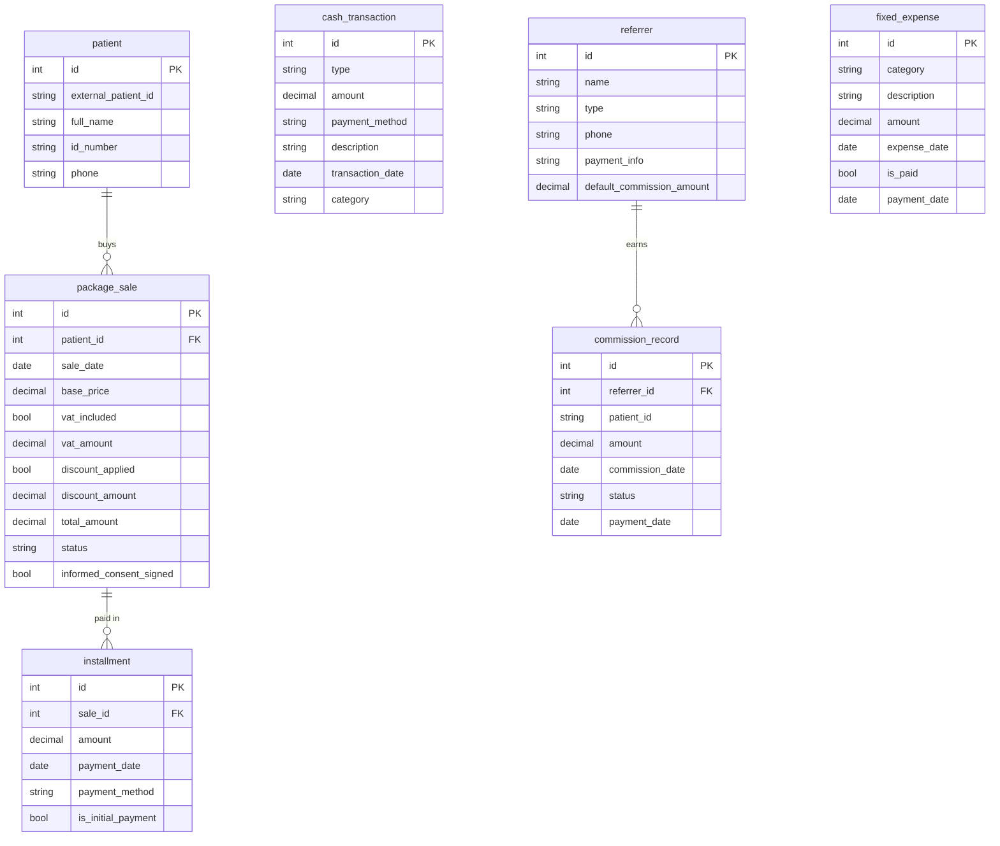

```mermaid
erDiagram
    patient {
        int id PK
        string external_patient_id
        string full_name
        string id_number
        string phone
    }

    cash_transaction {
        int id PK
        string type
        decimal amount
        string payment_method
        string description
        date transaction_date
        string category
    }

    package_sale {
        int id PK
        int patient_id FK
        date sale_date
        decimal base_price
        bool vat_included
        decimal vat_amount
        bool discount_applied
        decimal discount_amount
        decimal total_amount
        string status
        bool informed_consent_signed
    }

    installment {
        int id PK
        int sale_id FK
        decimal amount
        date payment_date
        string payment_method
        bool is_initial_payment
    }

    referrer {
        int id PK
        string name
        string type
        string phone
        string payment_info
        decimal default_commission_amount
    }

    commission_record {
        int id PK
        int referrer_id FK
        string patient_id
        decimal amount
        date commission_date
        string status
        date payment_date
    }

    fixed_expense {
        int id PK
        string category
        string description
        decimal amount
        date expense_date
        bool is_paid
        date payment_date
    }

    patient ||--o{ package_sale : "buys"
    package_sale ||--o{ installment : "paid in"
    referrer ||--o{ commission_record : "earns"

```