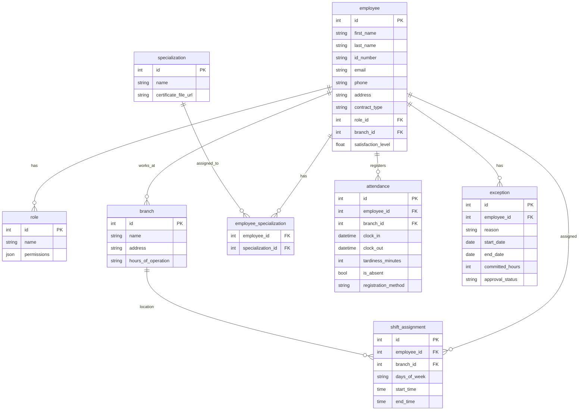

# Base de datos de personal-service: staff_db

##  Explicación de cada tabla de forma simple

###  `employee` → Los empleados
- Datos personales (nombre, cédula, email, teléfono)
- **`role_id`**: ¿Qué cargo tiene? (ej. médico, enfermero, recepcionista)
- **`branch_id`**: ¿En qué sucursal trabaja?
- **`contract_type`**: Tipo de contrato (fijo, temporal...)
- **`satisfaction_level`**: Satisfacción laboral (0 a 1)

###  `role` → Cargos o puestos
- **`name`**: Nombre del cargo
- **`permissions`**: Permisos en formato JSON (ej. `{"can_prescribe": true, "max_appointments": 20}`)

### `branch` → Sucursales
- Datos de cada sucursal (dirección, horario de atención)

### `specialization` → Habilidades/capacitaciones
- Ejemplos: "Cardiología", "Pediatría", "Medicina General"

### `employee_specialization` → Relación empleado ↔ especialización
- Un empleado puede tener **varias especializaciones** (tabla intermedia)

### `shift_assignment` → Turnos asignados
- Un empleado tiene un **horario recurrente** en una sucursal
- Ejemplo: "Dr. Juan — Consultorio 3 — Lunes a Viernes — 8:00 a 16:00"

### `attendance` → Registro de asistencia diaria
- Hora real de entrada/salida
- Minutos de tardanza
- Si estuvo ausente
- Método de registro (biométrico, manual, app)

### `exception` → Excepciones/permisos
- Ausencias programadas (licencia médica, vacaciones, capacitación)
- **`committed_hours`**: Horas que se comprometió a recuperar
- **`approval_status`**: pendiente / aprobado / rechazado

---

## Relaciones clave (lo que puede confundir)

-  Un empleado tiene **un** rol, **una** sucursal principal, pero puede **marcar asistencia en cualquier sucursal** (por eso `attendance` tiene `branch_id` independiente)
-  Un empleado puede tener **varios turnos en diferentes sucursales** (`shift_assignment`)
-  Las especializaciones son **opcionales y múltiples**
-  Las excepciones justifican por qué alguien no marcó asistencia

---

## Posibles dudas 

| Duda | Respuesta |
|------|-----------|
| ¿Por qué `branch_id` aparece en `employee` y en `attendance`? | El empleado tiene una sucursal base, pero puede trabajar eventualmente en otras |
| ¿`shift_assignment` y `attendance` no se repiten? | No, `shift_assignment` es el **horario planeado**, `attendance` es **lo que realmente ocurrió** |
| ¿Para qué `exception.committed_hours`? | Si un empleado falta 4 horas, puede acordar reponerlas después |
