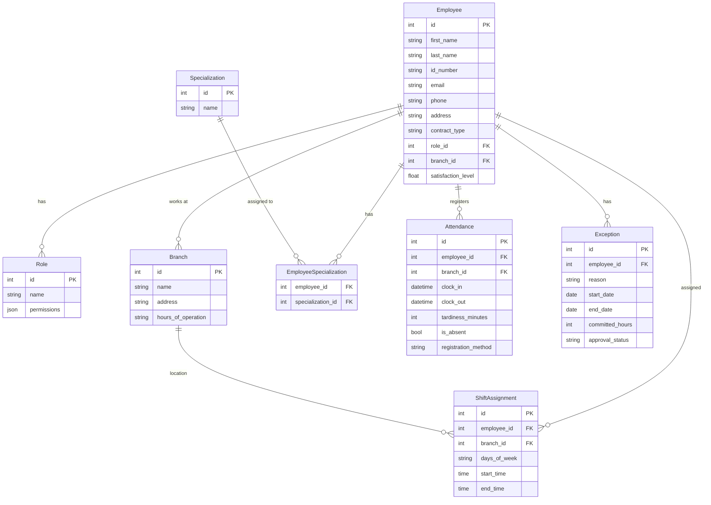

```mermaid
erDiagram
    Employee {
        int id PK
        string first_name
        string last_name
        string id_number
        string email
        string phone
        string address
        string contract_type
        int role_id FK
        int branch_id FK
        float satisfaction_level
    }

    Role {
        int id PK
        string name
        json permissions
    }

    Branch {
        int id PK
        string name
        string address
        string hours_of_operation
    }

    Specialization {
        int id PK
        string name
    }

    EmployeeSpecialization {
        int employee_id FK
        int specialization_id FK
    }

    ShiftAssignment {
        int id PK
        int employee_id FK
        int branch_id FK
        string days_of_week
        time start_time
        time end_time
    }

    Attendance {
        int id PK
        int employee_id FK
        int branch_id FK
        datetime clock_in
        datetime clock_out
        int tardiness_minutes
        bool is_absent
        string registration_method
    }

    Exception {
        int id PK
        int employee_id FK
        string reason
        date start_date
        date end_date
        int committed_hours
        string approval_status
    }

    Employee ||--o{ Branch : "works at"
    Employee ||--o{ Role : "has"
    Employee ||--o{ EmployeeSpecialization : "has"
    Specialization ||--o{ EmployeeSpecialization : "assigned to"
    Employee ||--o{ ShiftAssignment : "assigned"
    Branch ||--o{ ShiftAssignment : "location"
    Employee ||--o{ Attendance : "registers"
    Employee ||--o{ Exception : "has"

```