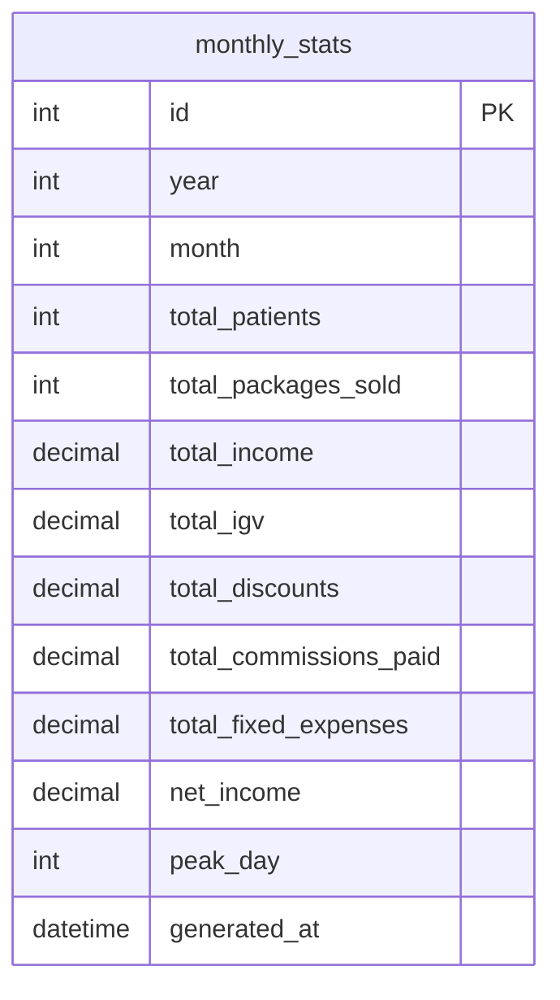

# Tabla payment-service: 
> **Importante, esta NO es una base de datos, es una tabla NO TRANSACICONAL que reside dentro de payments_db** 

---

## Explicacion detallada de la base de datos de reportes mejorada

### Objetivo
Esta base de datos de reportes es una **capa de informacion precalculada** que se genera automaticamente al cierre de cada mes. Su finalidad es permitir que los informes de alto nivel (paneles, graficos, resumenes mensuales) se obtengan de forma inmediata, sin necesidad de ejecutar consultas pesadas sobre las bases de datos transaccionales de empleados, pacientes y finanzas.

### Unica tabla: `monthly_stats` (Estadisticas Mensuales)

Es la unica tabla necesaria bajo la regla de negocio definida. Almacena un resumen completo de las operaciones de un mes especifico.

- **`id`**: Identificador unico del registro.
- **`year`** y **`month`**: Definen de forma univoca el periodo al que corresponde este resumen (ej. año=2026, mes=6 para junio). La combinacion de año y mes debe ser unica.
- **`total_patients`**: Cantidad de pacientes nuevos o unicos que realizaron al menos una compra en ese mes. Se obtiene contando `patient.id` asociados a `package_sale` con fecha en ese mes.
- **`total_packages_sold`**: Numero de ventas de paquetes cerradas en el mes (`package_sale` con `sale_date` en el rango).
- **`total_income`**: Ingreso bruto total del mes. Es la suma del campo `total_amount` de todas las ventas realizadas en ese mes.
- **`total_igv`**: Suma del IGV repercutido en todas esas ventas. Proviene de la columna `igv_amount` de `package_sale`.
- **`total_discounts`**: Suma de todos los descuentos aplicados en el mes. Ayuda a medir el impacto de las promociones.
- **`total_commissions_paid`**: Monto total de comisiones pagadas a referidores en el mes. Se calcula sumando los `amount` de `commission_record` cuyo `payment_date` cae dentro del mes.
- **`total_fixed_expenses`**: Suma de los gastos fijos efectivamente pagados en el mes. Se obtiene de `fixed_expense` con `payment_date` en el periodo.
- **`net_income`**: Resultado neto del mes, calculado como `total_income - total_igv - total_discounts - total_commissions_paid - total_fixed_expenses` (o la formula de negocio que se defina). Al estar precalculado, acelera la vista de rentabilidad.
- **`peak_day`**: Entero que representa el dia del mes (1-31) que registro el mayor volumen de ingresos (`total_amount`). Permite identificar rapidamente los picos de actividad.
- **`generated_at`**: Marca de tiempo que registra cuando el sistema automatico creo este resumen. Sirve para auditoria y para detectar posibles reprocesos.

### Relaciones
Esta tabla **no tiene relaciones explícitas** con el resto del sistema porque actua como un receptor de datos historicos consolidados. La generacion automatica lee las tablas `patient`, `package_sale`, `commission_record`, `fixed_expense` y escribe en `monthly_stats` mediante un proceso batch al final de cada mes.

### Justificacion de la eliminacion de `package_sale_summary`
Mantener una tabla de resumen a nivel de venta contradice la premisa de solo almacenar reportes mensuales. Si se necesita consultar el detalle de un paquete especifico o un listado de ventas diarias, es mas correcto y eficiente consultar directamente la base de datos operacional, que ya esta modelada de manera solida. De lo contrario, habria que mantener sincronizadas dos fuentes de verdad, lo cual es una mala practica.