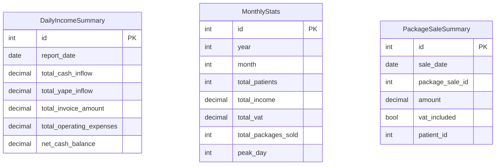

# Report Service Database Schema
Aclaracion, estas tablas no son 100% obligatorias, son sugerentes, los campos pueden ser solicitados de forma dinamica desde las otras bases de datos, se recomienda su uso para emitir informes automaticamente

