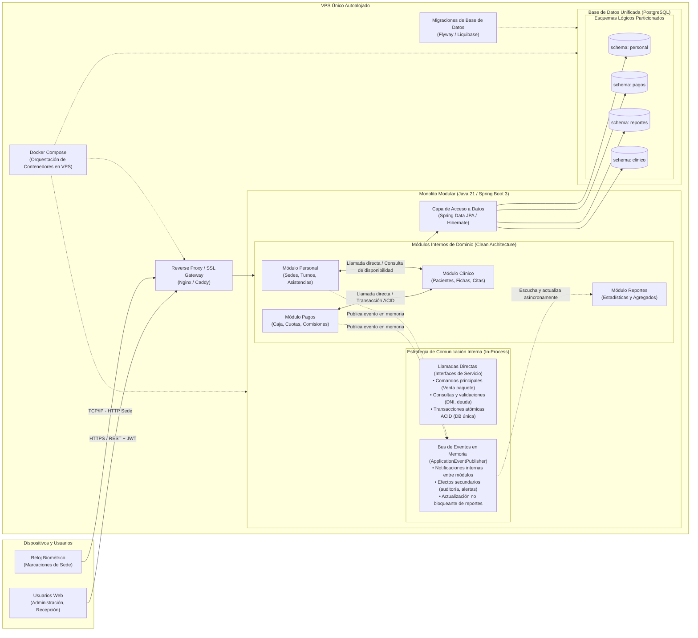

# Diagrama de Arquitectura Unificada (v2 Definitiva)

Arquitectura de producción basada en un **Monolito Modular con Clean Architecture** en **Java 21 / Spring Boot 3**, desplegado en un único **VPS autoalojado** con **PostgreSQL** y esquemas lógicos independientes.

> **Nota de Decisión:** Esta versión consolida la unificación de los equipos de desarrollo (RRHH/Pagos y Módulo Clínico), eliminando definitivamente el broker externo de mensajería (RabbitMQ / Azure Service Bus) en favor de llamadas transaccionales directas y eventos de dominio en memoria.

---

## Componentes y Principios Clave

1. **Proxy Inverso (Nginx / Caddy):** Termina conexiones SSL/TLS, distribuye solicitudes a los endpoints de la API REST y sirve como cortafuegos perimetral.
2. **Monolito Modular (Java 21 / Spring Boot 3):**
   - Todos los módulos se compilan y empaquetan en un solo artefacto ejecutable dentro de un contenedor Docker.
   - Cada módulo encapsula sus reglas de dominio, casos de uso y puertos según Clean Architecture.
3. **Comunicación Híbrida In-Process (ADR-0004):**
   - **Llamadas Directas:** Para operaciones que demandan consistencia inmediata y transaccionalidad ACID (ej. cobrar un paquete y habilitar sesiones terapéuticas al paciente simultáneamente).
   - **Eventos en Memoria (`ApplicationEventPublisher`):** Para desacoplar efectos secundarios, auditoría y actualización de agregados sin bloquear el hilo de ejecución principal.
4. **Base de Datos Unificada en PostgreSQL (ADR-0002):**
   - Una única instancia de base de datos dividida en 4 esquemas: `personal`, `pagos`, `reportes` y `clinico`.
   - Soporte multi-sede gobernado por la columna `sede_id` (ADR-0003).
5. **Cero Dependencias de Brokers Externos:** Se eliminó RabbitMQ, simplificando la operación y garantizando máxima estabilidad y bajo consumo de recursos en el servidor VPS.