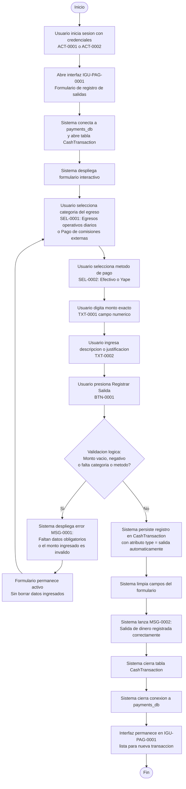
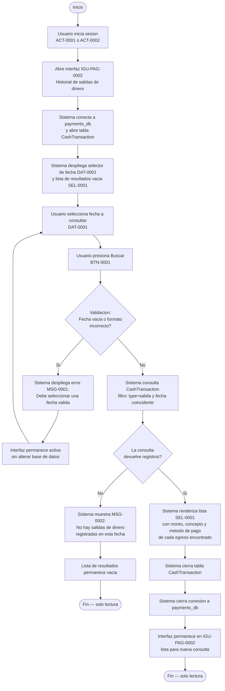
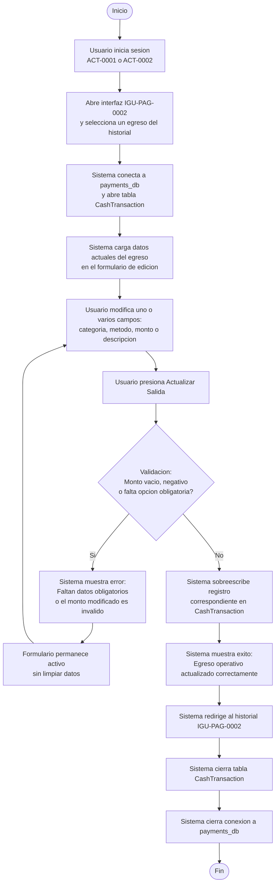
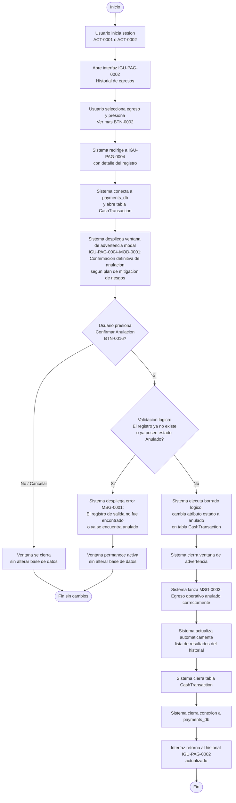

# Diagrama de Actividades — Egresos Operativos Diarios

**Educcion:** EDU-0001  
**Tabla afectada:** CashTransaction (payments_db)  
**Actores:** ACT-0001 (Gerente General), ACT-0002 (Cajera)

---

## Crear egreso operativo (ILA-PAG-0001 v02.05)

---

## Consultar historial de egresos operativos por fecha (ILA-PAG-0002 v03.00)

---

## Actualizar egreso operativo

---

## Anular egreso operativo (ILA-PAG-0004 v03.01)

