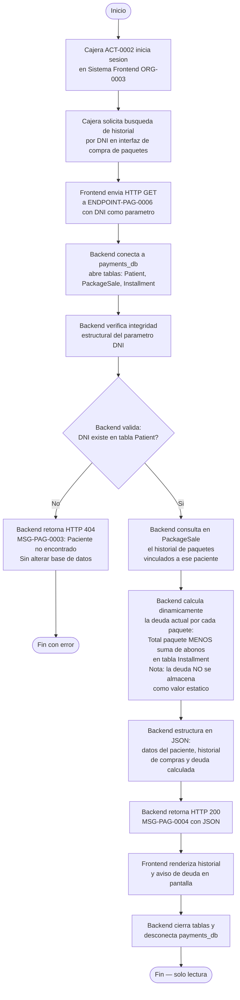
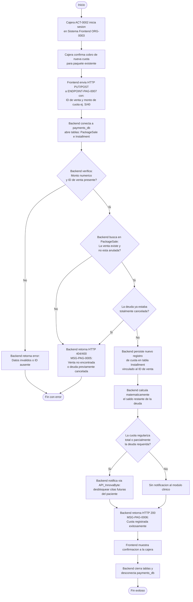
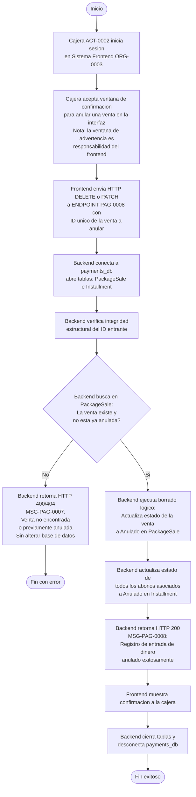

# Diagrama de Actividades — Entradas por Venta de Paquetes

**Educcion:** EDU-0002  
**Tablas afectadas:** Patient, PackageSale, Installment, CashTransaction, CommissionRecord (payments_db)  
**Actores:** ACT-0002 (Cajera), ORG-0003 (Sistema Frontend InnovaByte), API_InnovaByte (Modulo Clinico)

---

## Crear venta de paquete con abono inicial (ILA-PAG-0005 v02.04 y ILA-PAG-0001 v02.01)

> El frontend de InnovaByte (ORG-0003) aplica la matematica de negocio (IGV, descuento, validacion de S/50). El backend ejecuta persistencia atomica y notifica al modulo clinico.

```mermaid
flowchart TD
    A([Inicio]) --> B[Cajera ACT-0002 inicia sesion\nen Sistema Frontend ORG-0003]
    B --> C[Cajera abre formulario de\nGestion de Paquetes y Cobros IGU-0002]
    C --> D[Sistema despliega formulario con:\ncampo DNI paciente TXT-0002\nselector paquete CBO-0001]
    D --> E[Cajera ingresa DNI del paciente\ny selecciona paquete de salud]
    E --> F[Cajera marca casilla CHK-0002\nconfirmando que paciente firmo\nConsentimiento Informado fisicamente]

    F --> G{Cajera selecciona\ntipo de comprobante\nRDO-0001}
    G -- Factura --> H[Frontend calcula y suma\n18% de IGV al precio base LBL-0001]
    G -- Boleta --> I[Sin IGV aplicado]
    H --> J[Continua con precio final con IGV]
    I --> J

    J --> K{Fecha de evaluacion\ncoinicide con dia de compra?}
    K -- Si --> L[Frontend aplica descuento\nautomatico de S/25 al total]
    K -- No --> M[Sin descuento aplicado]
    L --> N[Continua con precio descontado]
    M --> N

    N --> O[Cajera ingresa monto del abono inicial\nTXT-0003]
    O --> P{Frontend valida:\nAbono inicial >= S/50\nmonto minimo de apertura?}
    P -- No --> Q[Frontend interrumpe flujo\ny muestra alerta MSG-0005:\nmonto menor al minimo permitido]
    Q --> O
    P -- Si --> R[Cajera presiona Registrar Venta BTN-0005]
    R --> S[Frontend envia HTTP POST\na ENDPOINT-PAG-0001 del backend\ncon payload: DNI, precio base,\nabono, indicadores IGV/descuento\ny derivador opcional]

    S --> T[Backend conecta a payments_db\nabre tablas: Patient, PackageSale,\nInstallment, CashTransaction\ny CommissionRecord si hay derivador]
    T --> U{Backend verifica\nintegridad estructural:\nmontos numericos y DNI presente?}
    U -- No --> V[Backend retorna HTTP 400\nMSG-PAG-0001:\nDatos inconsistentes]
    V --> W([Fin con error])

    U -- Si --> X{Backend valida:\nDNI existe en tabla Patient?}
    X -- No --> Y[Backend retorna HTTP 400\nMSG-PAG-0001:\nEl DNI no pertenece a\nun paciente registrado]
    Y --> W

    X -- Si --> Z[Backend recalcula internamente:\nIGV segun indicador booleano\nDescuento segun indicador booleano\nMonto total resultante]
    Z --> AA{Abono recibido\n>= S/50?}
    AA -- No --> AB[Backend retorna error:\nAbono menor al minimo permitido]
    AB --> W

    AA -- Si --> AC[Backend persiste atomicamente:]
    AC --> AD[1. Datos de venta en PackageSale]
    AD --> AE[2. Abono inicial en Installment\ncon is_initial_payment = true]
    AE --> AF[3. Ingreso financiero en CashTransaction]
    AF --> AG{Existe identificador\nde derivador en payload?}
    AG -- Si --> AH[4. Registra deuda de comision\nen CommissionRecord]
    AG -- No --> AI[Omite CommissionRecord]
    AH --> AJ[Backend notifica via API_InnovaByte:\npaciente tiene paquete pagado\nhabilitar control de asistencias]
    AI --> AJ
    AJ --> AK[Backend retorna HTTP 200\nMSG-PAG-0002:\nEntrada de dinero y abono inicial\ncalculados y registrados exitosamente]
    AK --> AL[Frontend muestra confirmacion MSG-0006\na la cajera]
    AL --> AM[Frontend limpia formulario IGU-0002]
    AM --> AN[Backend cierra tablas y\ndesconecta payments_db]
    AN --> AO([Fin exitoso])
```

---

## Consultar historial de paquetes y deuda por DNI (ILA-PAG-0006 v02.05)

---

## Registrar pago de cuota (ILA-PAG-0007 v02.01)

---

## Anular venta de paquete (ILA-PAG-0008 v02.00)

