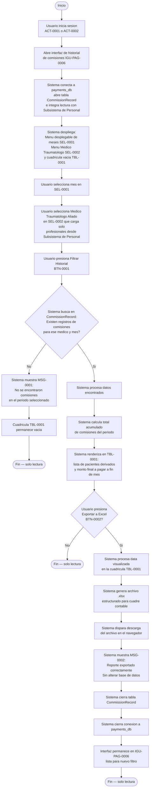
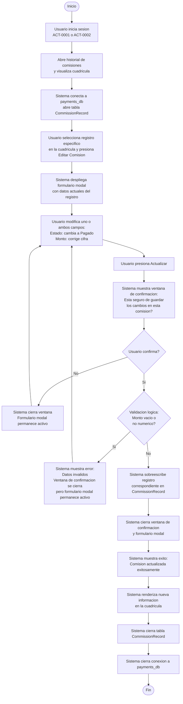
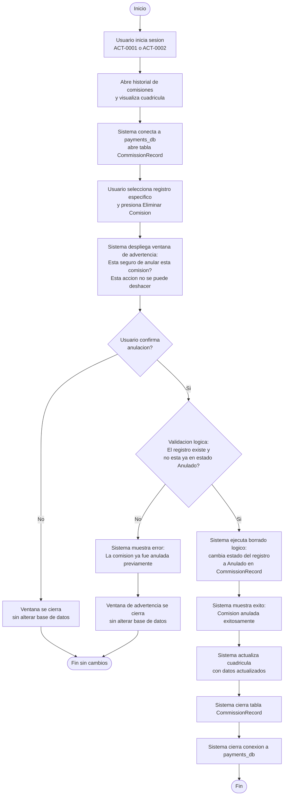

# Diagrama de Actividades — Comisiones Externas

**Educcion:** EDU-0005  
**Tabla afectada:** CommissionRecord (payments_db), integracion lectura con Subsistema de Personal  
**Actores:** ACT-0001 (Gerente General), ACT-0002 (Cajera)  
**Tipos de derivador:** Promotor Externo (coloquialmente jaladora) y Medico Traumatologo Aliado

---

## Crear registro de pago o deuda de comision (ILA-PAG-0009 v03.00)

```mermaid
flowchart TD
    A([Inicio]) --> B[Usuario inicia sesion\nACT-0001 o ACT-0002]
    B --> C[Abre interfaz de registro\nde comisiones IGU-PAG-0005]
    C --> D[Sistema conecta a payments_db\nabre tabla CommissionRecord\ne integra lectura con Subsistema de Personal]
    D --> E[Sistema despliega formulario con:\nBuscador de derivador SEL-0001\nCampo Yape o banco solo lectura TXT-0001\nCampo monto TXT-0002\nSelector estado SEL-0002: Pagado o Pendiente]
    E --> F[Usuario busca y selecciona derivador\ndesde SEL-0001 que carga\nregistros activos del Subsistema de Personal]
    F --> G[Sistema identifica automaticamente\ncategoria del derivador seleccionado]
    G --> H{Cual es la\ncategoria?}
    H -- Promotor Externo --> I[Sistema obtiene telefono Yape\ndel derivador desde Personal\ny lo muestra bloqueado en TXT-0001]
    H -- Medico Traumatologo --> J[Sistema obtiene cuenta bancaria\ndel derivador desde Personal\ny la muestra bloqueada en TXT-0001]
    I --> K[Usuario digita monto a comisionar\nen TXT-0002 ej. S/25]
    J --> K
    K --> L[Usuario establece estado del registro\nen SEL-0002: Pagado o Pendiente]
    L --> M[Usuario presiona Registrar Comision\nBTN-0001]
    M --> N{Validacion logica:\nDerivador seleccionado?\nMonto valido y no vacio?\nEstado definido?}
    N -- No --> O[Sistema despliega error MSG-0001:\nFaltan datos obligatorios\no el monto ingresado es invalido]
    O --> P[Formulario permanece activo\nsin borrar seleccion previa]
    P --> K
    N -- Si --> Q[Sistema persiste datos\nde la nueva comision en CommissionRecord\nvinculada al ID del derivador]
    Q --> R[Sistema limpia campos del formulario]
    R --> S[Sistema lanza MSG-0002:\nRegistro de comision creado exitosamente]
    S --> T[Sistema cierra tabla CommissionRecord]
    T --> U[Sistema cierra conexion a payments_db]
    U --> V[Interfaz permanece en IGU-PAG-0005\nlista para nueva transaccion]
    V --> W([Fin])
```

---

## Consultar historial de comisiones y exportar reporte a Excel (ILA-PAG-0010 v02.00)

---

## Actualizar estado o monto de comision (ILA-PAG-0011)

---

## Anular registro de comision (ILA-PAG-0012)

