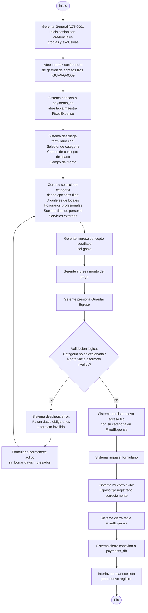
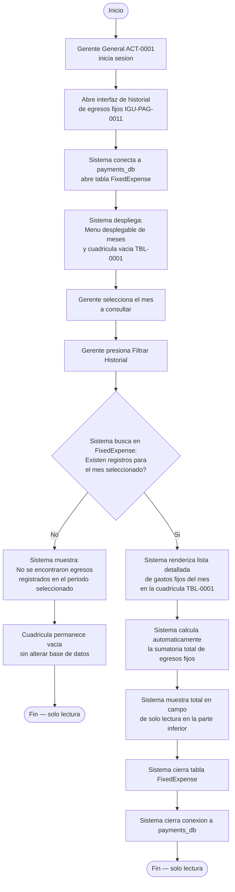
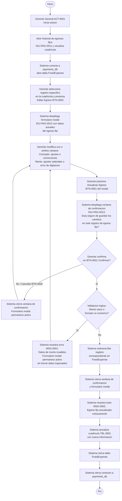
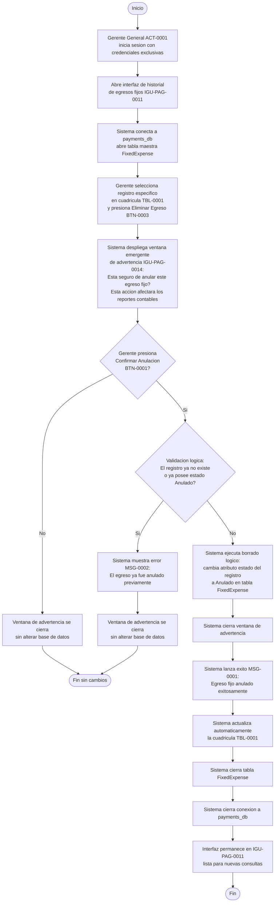

# Diagrama de Actividades — Egresos Fijos Mensuales

**Educcion:** EDU-0021  
**Tabla afectada:** FixedExpense (payments_db)  
**Actor:** ACT-0001 (Gerente General) — acceso exclusivo y confidencial  
**Categorias disponibles:** Alquileres de locales, Honorarios profesionales, Sueldos fijos de personal, Servicios externos

---

## Crear egreso fijo mensual (ILA-PAG-0013)

---

## Consultar historial de egresos fijos por mes (ILA-PAG-0014)

---

## Actualizar egreso fijo (ILA-PAG-0015)

---

## Anular egreso fijo (ILA-PAG-0016 v02.00)

