# Diagrama de Actividades – Servicio de Pagos

Cubre los cuatro módulos operativos: egresos operativos, entradas por venta de paquetes, comisiones externas y egresos fijos mensuales.

---

## A. Egresos Operativos Diarios (CashTransaction)

### A1. Crear Egreso Operativo

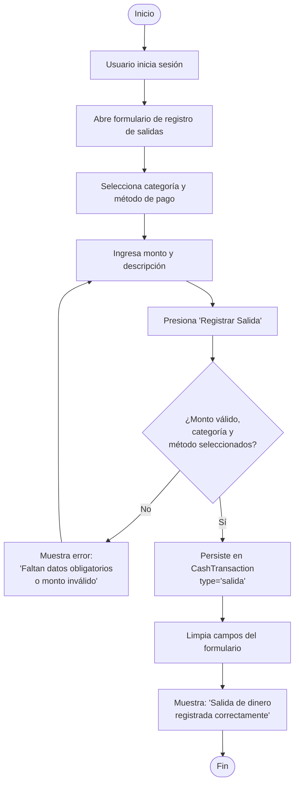

### A2. Consultar Historial de Egresos

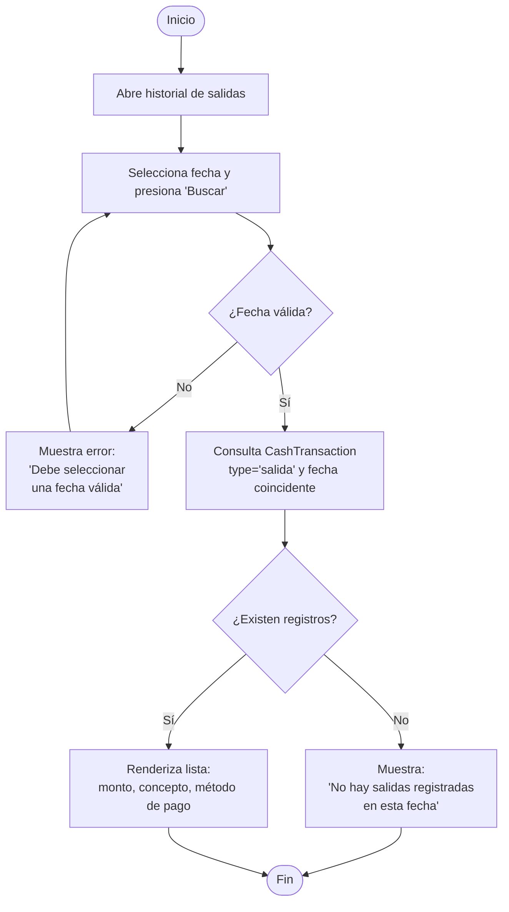

### A3. Actualizar Egreso Operativo

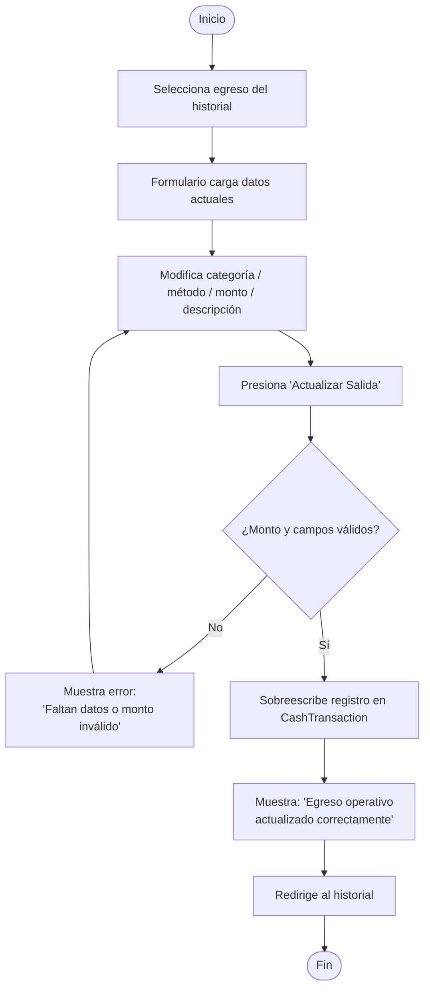

### A4. Anular Egreso Operativo

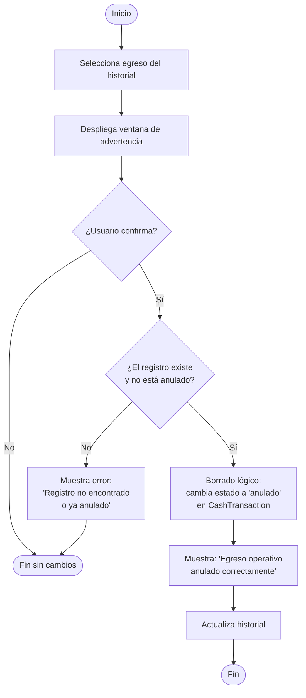

---

## B. Entradas por Venta de Paquetes (PackageSale / Installment)

### B1. Crear Registro de Entrada de Dinero

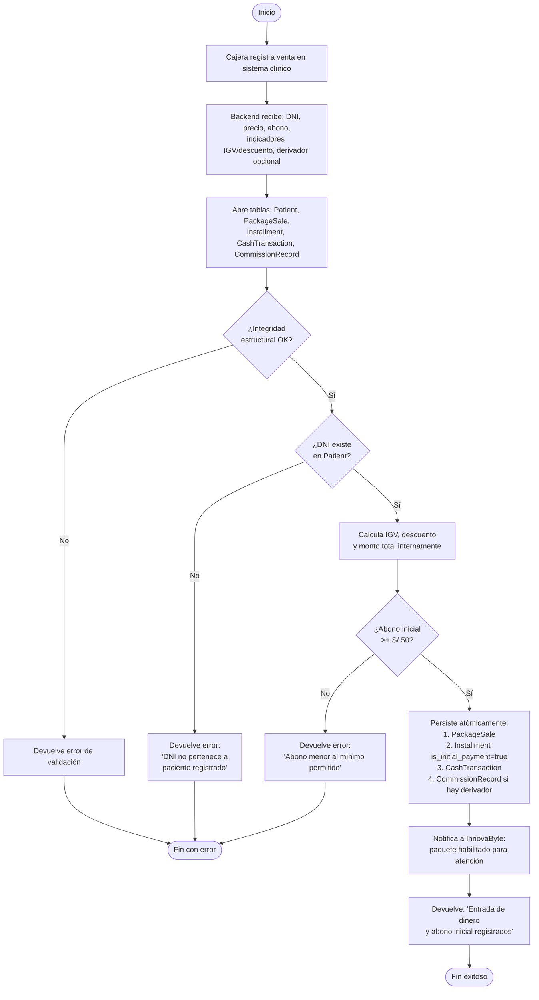

### B2. Registrar Pago de Cuota

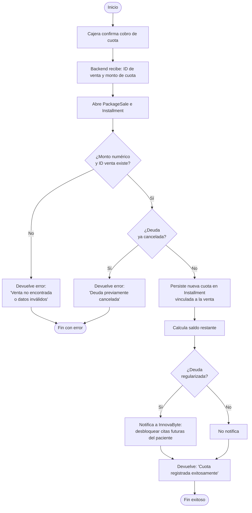

### B3. Anular Registro de Venta

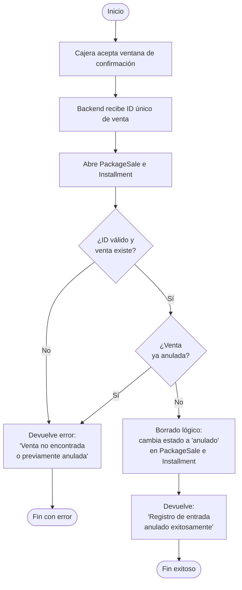

---

## C. Comisiones Externas (CommissionRecord)

### C1. Registrar Comisión

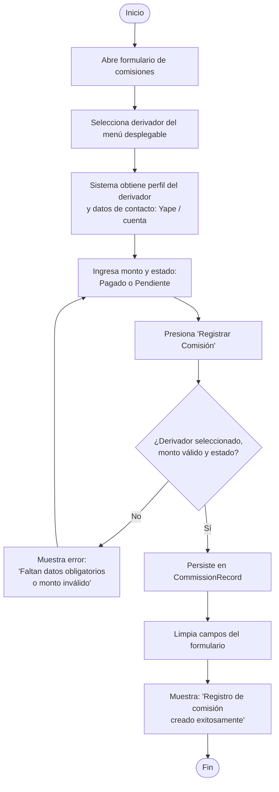

### C2. Actualizar Comisión

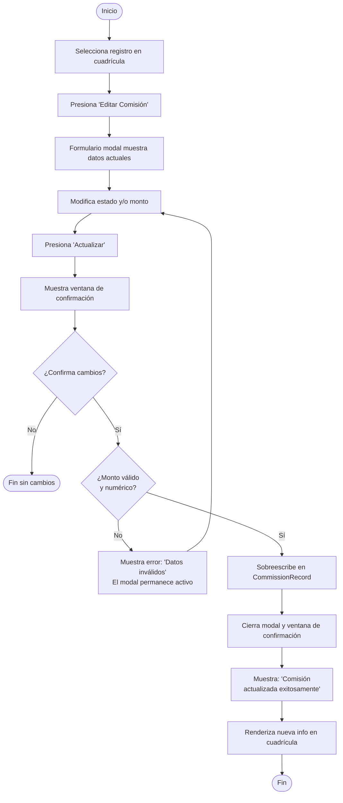

### C3. Anular Comisión

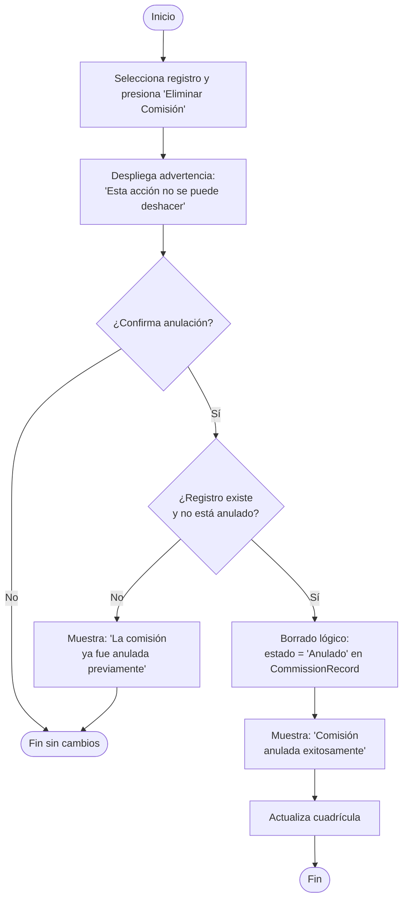

---

## D. Egresos Fijos Mensuales (FixedExpense) — Solo Gerente General

### D1. Crear Egreso Fijo

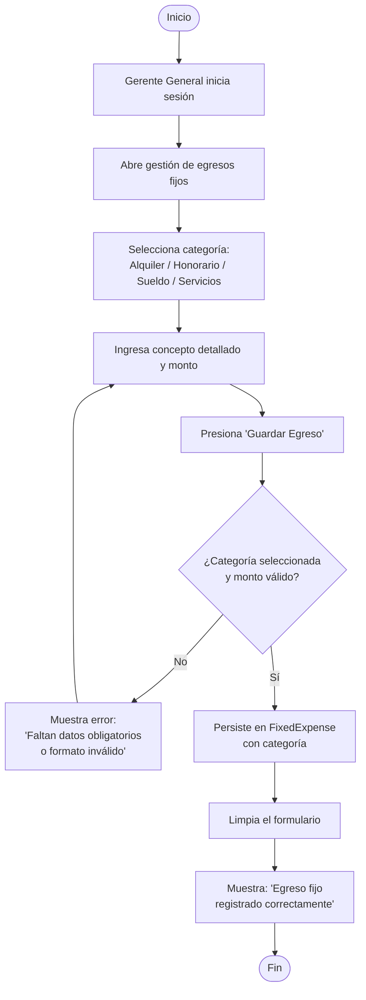

### D2. Actualizar / Anular Egreso Fijo

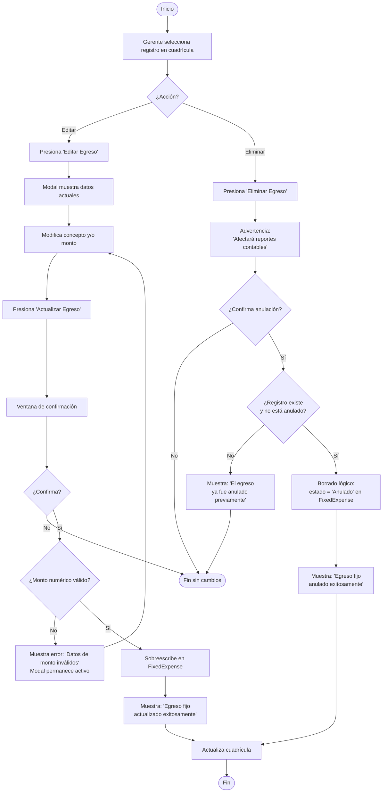
