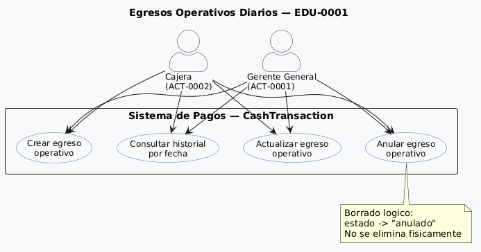
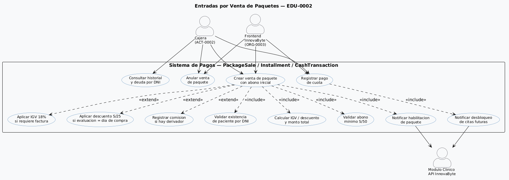
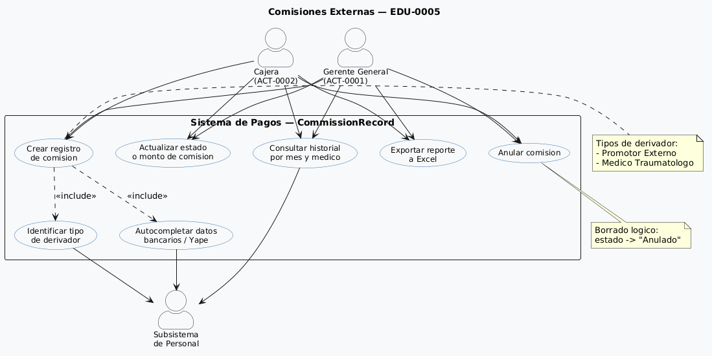
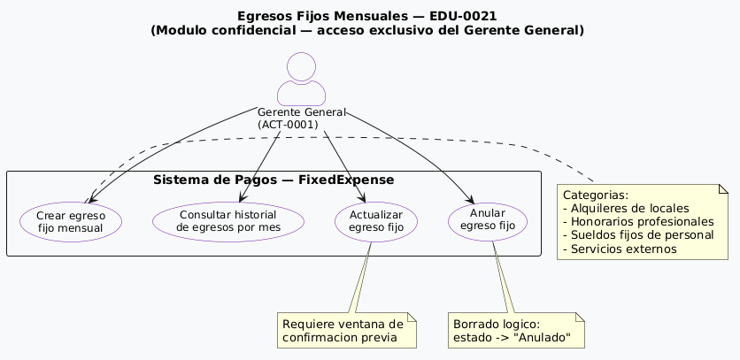

# Diagrama de Casos de Uso — Modulo de Pagos

## Actores del sistema

| Codigo | Actor | Descripcion |
|---|---|---|
| ACT-0001 | Gerente General | Acceso completo. Unico con acceso a egresos fijos mensuales |
| ACT-0002 | Cajera | Gestiona ventas, egresos operativos y comisiones |
| ORG-0003 | Sistema Frontend InnovaByte | Envia peticiones HTTP al backend de pagos |
| API_InnovaByte | Modulo Clinico InnovaByte | Receptor de notificaciones de habilitacion y desbloqueo |

---

## Diagrama 1 — Egresos Operativos Diarios

Actores: Cajera (ACT-0002) y Gerente General (ACT-0001). Ambos pueden ejecutar los cuatro casos de uso. Tabla afectada: **CashTransaction**.

---

## Diagrama 2 — Entradas por Venta de Paquetes

Actores: Cajera (ACT-0002), Frontend InnovaByte (ORG-0003) y Modulo Clinico (API InnovaByte). Incluye relaciones `<<include>>` hacia notificaciones clinicas y relaciones `<<extend>>` condicionales para IGV, descuento y comision automatica. Tablas afectadas: **PackageSale, Installment, CashTransaction, CommissionRecord**.

---

## Diagrama 3 — Comisiones Externas

Actores: Cajera (ACT-0002) y Gerente General (ACT-0001). El sistema integra lectura del Subsistema de Personal para obtener datos de derivadores. Tabla afectada: **CommissionRecord**.

---

## Diagrama 4 — Egresos Fijos Mensuales

Actor exclusivo: Gerente General (ACT-0001). Modulo confidencial sin acceso para la Cajera. Tabla afectada: **FixedExpense**.

---

## Tabla de casos de uso

| Codigo | Nombre | Actor | EDU | Tabla afectada |
|---|---|---|---|---|
| UC-EO-01 | Crear egreso operativo | ACT-0001, ACT-0002 | EDU-0001 | CashTransaction |
| UC-EO-02 | Consultar historial de egresos por fecha | ACT-0001, ACT-0002 | EDU-0001 | CashTransaction (lectura) |
| UC-EO-03 | Actualizar egreso operativo | ACT-0001, ACT-0002 | EDU-0001 | CashTransaction |
| UC-EO-04 | Anular egreso operativo | ACT-0001, ACT-0002 | EDU-0001 | CashTransaction |
| UC-EP-01 | Crear venta con abono inicial | ACT-0002, ORG-0003 | EDU-0002 | PackageSale, Installment, CashTransaction, CommissionRecord |
| UC-EP-02 | Consultar historial y deuda por DNI | ACT-0002 | EDU-0002 | Patient, PackageSale, Installment (lectura) |
| UC-EP-03 | Registrar pago de cuota | ACT-0002, ORG-0003 | EDU-0002 | Installment |
| UC-EP-04 | Anular venta de paquete | ACT-0002, ORG-0003 | EDU-0002 | PackageSale, Installment |
| UC-CE-01 | Crear registro de comision | ACT-0001, ACT-0002 | EDU-0005 | CommissionRecord |
| UC-CE-02 | Consultar historial de comisiones | ACT-0001, ACT-0002 | EDU-0005 | CommissionRecord (lectura) |
| UC-CE-03 | Exportar reporte de comisiones a Excel | ACT-0001, ACT-0002 | EDU-0005 | CommissionRecord (lectura) |
| UC-CE-04 | Actualizar comision | ACT-0001, ACT-0002 | EDU-0005 | CommissionRecord |
| UC-CE-05 | Anular comision | ACT-0001, ACT-0002 | EDU-0005 | CommissionRecord |
| UC-EF-01 | Crear egreso fijo mensual | ACT-0001 | EDU-0021 | FixedExpense |
| UC-EF-02 | Consultar historial de egresos fijos | ACT-0001 | EDU-0021 | FixedExpense (lectura) |
| UC-EF-03 | Actualizar egreso fijo | ACT-0001 | EDU-0021 | FixedExpense |
| UC-EF-04 | Anular egreso fijo | ACT-0001 | EDU-0021 | FixedExpense |

---

## Reglas de negocio criticas

| Regla | Aplica en | Descripcion |
|---|---|---|
| Abono minimo S/50 | UC-EP-01 | El abono inicial no puede ser menor a S/50. El backend interrumpe el flujo |
| IGV 18% | UC-EP-01 | Si el paciente requiere factura, se suma automaticamente el 18% al precio base |
| Descuento S/25 | UC-EP-01 | Si la fecha de evaluacion coincide con el dia de compra, se aplica descuento automatico |
| Consentimiento informado | UC-EP-01 | La cajera debe confirmar que el paciente firmo fisicamente el consentimiento |
| Deuda dinamica | UC-EP-02, UC-EP-03 | La deuda no se guarda como valor estatico. Se calcula al vuelo desde Installment |
| Comision automatica | UC-EP-01 | Si la venta incluye derivador, se registra automaticamente la deuda en CommissionRecord |
| Clasificacion de derivador | UC-CE-01 | Sistema identifica si es Promotor Externo o Medico Traumatologo y autocompleta datos bancarios |
| Borrado logico obligatorio | Todos los UC de anulacion | Ninguna anulacion elimina fisicamente el registro. Solo cambia estado a Anulado |
| Confirmacion previa | UC-EO-04, UC-CE-04, UC-CE-05, UC-EF-03, UC-EF-04 | Ventana de advertencia modal obligatoria antes de actualizar o anular |
| Exclusividad del Gerente | UC-EF-01 al UC-EF-04 | Los egresos fijos son accesibles unicamente por ACT-0001 |
| Notificacion post-venta | UC-EP-01 | Backend notifica via API_InnovaByte que el paquete esta habilitado para asistencias |
| Notificacion post-cuota | UC-EP-03 | Si la cuota regulariza la deuda, backend notifica para desbloquear citas futuras |
| Backend aplica matematica | UC-EP-01 | IGV, descuento y total los calcula el backend independientemente del frontend |
