# Diagrama de Casos de Uso — Modulo de Pagos

## Actores del sistema

| Codigo | Actor | Descripcion |
|---|---|---|
| ACT-0001 | Gerente General | Acceso completo. Unico con acceso a egresos fijos mensuales y reportes |
| ACT-0002 | Cajera | Gestiona entradas por ventas, egresos operativos y comisiones |
| ORG-0003 | Sistema Frontend InnovaByte | Envia peticiones HTTP al backend de pagos y recibe notificaciones |
| API_InnovaByte | Modulo Clinico InnovaByte | Receptor de notificaciones de habilitacion y desbloqueo de pacientes |

---

## Diagrama general

```mermaid
graph TD
    Cajera([Cajera\nACT-0002])
    Gerente([Gerente General\nACT-0001])
    Frontend([Sistema Frontend\nInnovaByte - ORG-0003])
    Clinico([Modulo Clinico\nAPI InnovaByte])

    subgraph PAG ["Sistema de Pagos — payments_db"]

        subgraph EO ["Egresos Operativos Diarios — CashTransaction"]
            UC_EO1["Crear egreso operativo"]
            UC_EO2["Consultar historial de egresos por fecha"]
            UC_EO3["Actualizar egreso operativo"]
            UC_EO4["Anular egreso operativo\n(borrado logico)"]
        end

        subgraph EP ["Entradas por Venta de Paquetes — PackageSale / Installment / CashTransaction"]
            UC_EP1["Crear venta de paquete\ncon abono inicial"]
            UC_EP2["Consultar historial de paquetes\ny deuda por DNI"]
            UC_EP3["Registrar pago de cuota"]
            UC_EP4["Anular venta de paquete\n(borrado logico)"]
        end

        subgraph CE ["Comisiones Externas — CommissionRecord"]
            UC_CE1["Crear registro de comision\n(Promotor Externo o Medico Traumatologo)"]
            UC_CE2["Consultar historial de comisiones\nfiltrado por mes y medico"]
            UC_CE3["Exportar reporte de comisiones\na formato Excel"]
            UC_CE4["Actualizar estado o monto\nde comision"]
            UC_CE5["Anular comision\n(borrado logico)"]
        end

        subgraph EF ["Egresos Fijos Mensuales — FixedExpense"]
            UC_EF1["Crear egreso fijo mensual\n(Alquiler / Honorario / Sueldo / Servicios)"]
            UC_EF2["Consultar historial de egresos fijos\nfiltrado por mes"]
            UC_EF3["Actualizar egreso fijo"]
            UC_EF4["Anular egreso fijo\n(borrado logico)"]
        end

        subgraph INT ["Integracion con InnovaByte"]
            UC_INT1["Validar existencia de paciente\npor DNI en Patient"]
            UC_INT2["Notificar habilitacion de paquete\npost-venta exitosa"]
            UC_INT3["Notificar regularizacion de deuda\npost-pago de cuota"]
        end

        subgraph VAL ["Validaciones transversales"]
            UC_VAL1["Verificar sesion activa\ncon credenciales validas"]
            UC_VAL2["Validar monto minimo\nde abono inicial S/50"]
            UC_VAL3["Calcular IGV 18%\nsi requiere factura"]
            UC_VAL4["Aplicar descuento S/25\nsi compra el mismo dia de evaluacion"]
            UC_VAL5["Verificar consentimiento\ninformado firmado"]
            UC_VAL6["Calcular deuda dinamicamente\ndesde tabla Installment"]
        end
    end

    %% Cajera
    Cajera --> UC_EO1
    Cajera --> UC_EO2
    Cajera --> UC_EO3
    Cajera --> UC_EO4
    Cajera --> UC_EP2
    Cajera --> UC_EP3
    Cajera --> UC_EP4
    Cajera --> UC_CE1
    Cajera --> UC_CE2
    Cajera --> UC_CE3
    Cajera --> UC_CE4
    Cajera --> UC_CE5

    %% Gerente General
    Gerente --> UC_EO1
    Gerente --> UC_EO2
    Gerente --> UC_EO3
    Gerente --> UC_EO4
    Gerente --> UC_CE1
    Gerente --> UC_CE2
    Gerente --> UC_CE3
    Gerente --> UC_CE4
    Gerente --> UC_CE5
    Gerente --> UC_EF1
    Gerente --> UC_EF2
    Gerente --> UC_EF3
    Gerente --> UC_EF4

    %% Frontend InnovaByte dispara la creacion de ventas y cuotas via endpoint
    Frontend --> UC_EP1

    %% Relaciones include
    UC_EP1 -.->|"include"| UC_INT1
    UC_EP1 -.->|"include"| UC_INT2
    UC_EP1 -.->|"include"| UC_VAL1
    UC_EP1 -.->|"include"| UC_VAL2
    UC_EP1 -.->|"include"| UC_VAL5
    UC_EP3 -.->|"include"| UC_INT3
    UC_EP3 -.->|"include"| UC_VAL6

    %% Relaciones extend
    UC_EP1 -.->|"extend\nsi requiere factura"| UC_VAL3
    UC_EP1 -.->|"extend\nsi evaluacion = dia de compra"| UC_VAL4
    UC_EP1 -.->|"extend\nsi hay derivador"| UC_CE1

    %% InnovaByte receptor
    UC_INT1 --> Clinico
    UC_INT2 --> Clinico
    UC_INT3 --> Clinico

    %% Estilos
    style PAG fill:#f8f9fa,stroke:#495057,stroke-width:2px
    style EO fill:#e8f5e9,stroke:#2e7d32
    style EP fill:#fff8e1,stroke:#f57f17
    style CE fill:#fce4ec,stroke:#c62828
    style EF fill:#ede7f6,stroke:#4527a0
    style INT fill:#e0f2f1,stroke:#00695c
    style VAL fill:#e3f2fd,stroke:#1565c0
```

---

## Tabla de casos de uso

| Codigo | Nombre | Actor principal | EDU | Tabla afectada |
|---|---|---|---|---|
| UC-EO-01 | Crear egreso operativo | ACT-0001, ACT-0002 | EDU-0001 | CashTransaction |
| UC-EO-02 | Consultar historial de egresos por fecha | ACT-0001, ACT-0002 | EDU-0001 | CashTransaction (solo lectura) |
| UC-EO-03 | Actualizar egreso operativo | ACT-0001, ACT-0002 | EDU-0001 | CashTransaction |
| UC-EO-04 | Anular egreso operativo | ACT-0001, ACT-0002 | EDU-0001 | CashTransaction |
| UC-EP-01 | Crear venta con abono inicial | ACT-0002, ORG-0003 | EDU-0002 | PackageSale, Installment, CashTransaction, CommissionRecord |
| UC-EP-02 | Consultar historial y deuda por DNI | ACT-0002 | EDU-0002 | Patient, PackageSale, Installment (solo lectura) |
| UC-EP-03 | Registrar pago de cuota | ACT-0002, ORG-0003 | EDU-0002 | Installment |
| UC-EP-04 | Anular venta de paquete | ACT-0002, ORG-0003 | EDU-0002 | PackageSale, Installment |
| UC-CE-01 | Crear registro de comision | ACT-0001, ACT-0002 | EDU-0005 | CommissionRecord |
| UC-CE-02 | Consultar historial de comisiones | ACT-0001, ACT-0002 | EDU-0005 | CommissionRecord (solo lectura) |
| UC-CE-03 | Exportar reporte de comisiones a Excel | ACT-0001, ACT-0002 | EDU-0005 | CommissionRecord (solo lectura) |
| UC-CE-04 | Actualizar comision | ACT-0001, ACT-0002 | EDU-0005 | CommissionRecord |
| UC-CE-05 | Anular comision | ACT-0001, ACT-0002 | EDU-0005 | CommissionRecord |
| UC-EF-01 | Crear egreso fijo mensual | ACT-0001 | EDU-0021 | FixedExpense |
| UC-EF-02 | Consultar historial de egresos fijos | ACT-0001 | EDU-0021 | FixedExpense (solo lectura) |
| UC-EF-03 | Actualizar egreso fijo | ACT-0001 | EDU-0021 | FixedExpense |
| UC-EF-04 | Anular egreso fijo | ACT-0001 | EDU-0021 | FixedExpense |

---

## Reglas de negocio criticas (extraidas de las ilaciones)

| Regla | Aplica en | Descripcion |
|---|---|---|
| Abono minimo S/50 | UC-EP-01 | El abono inicial de una venta no puede ser menor a S/50. El sistema interrumpe el flujo y lanza error |
| IGV 18% | UC-EP-01 | Si el paciente requiere factura, el sistema suma automaticamente el 18% al precio base |
| Descuento S/25 | UC-EP-01 | Si la fecha de evaluacion coincide con el dia de compra, el sistema aplica descuento automatico |
| Consentimiento informado | UC-EP-01 | La cajera debe marcar la casilla confirmando que el paciente firmo fisicamente el consentimiento |
| Deuda dinamica | UC-EP-02, UC-EP-03 | La deuda no se almacena como valor estatico. Se calcula al vuelo restando abonos en Installment al total |
| Comision automatica por derivacion | UC-EP-01 | Si la venta incluye un derivador, se registra automaticamente la deuda de comision en CommissionRecord |
| Clasificacion de derivador | UC-CE-01 | El sistema identifica si el derivador es Promotor Externo o Medico Traumatologo y autocompletada datos bancarios |
| Borrado logico | Todos los flujos de anulacion | Ninguna anulacion elimina fisicamente el registro. Solo cambia el estado a Anulado |
| Confirmacion previa a cambio sensible | UC-EO-04, UC-CE-04, UC-CE-05, UC-EF-03, UC-EF-04 | El sistema despliega ventana de advertencia modal antes de ejecutar actualizacion o anulacion |
| Exclusividad del Gerente General | UC-EF-01 al UC-EF-04 | Los egresos fijos son accesibles unicamente por ACT-0001 |
| Notificacion clinica post-venta | UC-EP-01 | Luego de persistir exitosamente, el backend notifica via API_InnovaByte que el paquete esta habilitado |
| Notificacion clinica post-cuota | UC-EP-03 | Si la cuota regulariza parcial o totalmente la deuda, el backend notifica para desbloquear citas futuras |
| Backend calcula matematica financiera | UC-EP-01 | El backend aplica IGV, descuento y calcula el total independientemente del frontend para evitar manipulacion |
