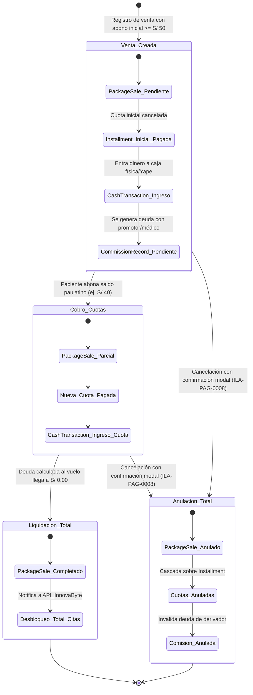

# Diagramas de Estados Consolidados — Servicio de Pagos (`payments-service`)

Este documento consolida el modelo dinámico de estados del servicio de pagos. Modela los ciclos de vida, reglas de negocio de transición y efectos de persistencia sobre las entidades clave de la base de datos `payments_db`.

---

## 1. Mapa de Entidades y Estados

| Entidad | Tabla en DB | Estados Posibles | Regla de Terminación | Documento Detallado |
| :--- | :--- | :--- | :--- | :--- |
| **Venta de Paquete** | `PackageSale` | `Pendiente`, `Parcialmente_Pagado`, `Completado`, `Anulado` | Borrado lógico (`anulado`) o liquidación al 100% (`completado`) | [std-01-package-sale-installment.md](file:///c:/Users/luisg/OneDrive/Documentos/Universidad/8vo/Arquitectura/architecture-docs/services/payments/diagrama%20de%20estados/std-01-package-sale-installment.md) |
| **Cuota / Compromiso** | `Installment` | `Pendiente`, `Pagada_Parcial`, `Pagada`, `Vencida`, `Anulada` | Pago total de cuota o anulación en cascada | [std-01-package-sale-installment.md](file:///c:/Users/luisg/OneDrive/Documentos/Universidad/8vo/Arquitectura/architecture-docs/services/payments/diagrama%20de%20estados/std-01-package-sale-installment.md) |
| **Comisión Externa** | `CommissionRecord` | `Pendiente`, `Pagado`, `Anulado` | Pago verificado vía Yape/banco o anulación lógica | [std-02-commission-record.md](file:///c:/Users/luisg/OneDrive/Documentos/Universidad/8vo/Arquitectura/architecture-docs/services/payments/diagrama%20de%20estados/std-02-commission-record.md) |
| **Transacción de Caja** | `CashTransaction` | `Activo`, `Modificado`, `Anulado`, `Conciliado` | Cierre diario de caja (arqueo) o anulación lógica | [std-03-cash-transaction-fixed-expense.md](file:///c:/Users/luisg/OneDrive/Documentos/Universidad/8vo/Arquitectura/architecture-docs/services/payments/diagrama%20de%20estados/std-03-cash-transaction-fixed-expense.md) |
| **Egreso Fijo Mensual** | `FixedExpense` | `Registrado`, `Modificado`, `Pagado`, `Anulado` | Pago de sueldo/alquiler o anulación lógica | [std-03-cash-transaction-fixed-expense.md](file:///c:/Users/luisg/OneDrive/Documentos/Universidad/8vo/Arquitectura/architecture-docs/services/payments/diagrama%20de%20estados/std-03-cash-transaction-fixed-expense.md) |

---

## 2. Visión Integrada: Ciclo de Vida Financiero Global

El siguiente diagrama sintetiza cómo interactúan los estados de una venta, sus pagos, el impacto en caja y las comisiones derivadas:

---

## 3. Principios de Consistencia de Estados

1. **Inmutabilidad de Auditoría (Borrado Lógico):** Ningún registro financiero se elimina físicamente mediante `DELETE FROM`. Todas las anulaciones transitan el estado a `anulado` o `Anulado`, preservando la fila para auditoría contable.
2. **Desacoplamiento Deuda vs. Movimiento de Caja:** Una cuota en estado `Pendiente` en `Installment` representa una promesa u obligación. Solo cuando pasa a `Pagada` se crea la tupla correspondiente en `CashTransaction` con su respectivo método de pago.
3. **Cálculo de Deuda Dinámica:** La venta no mantiene un campo estático de saldo deudor. El estado comercial (`Pendiente`, `Parcialmente_Pagado` o `Completado`) se infiere matemáticamente contrastando `total_amount` con la suma de `paid_amount` de las cuotas activas.
