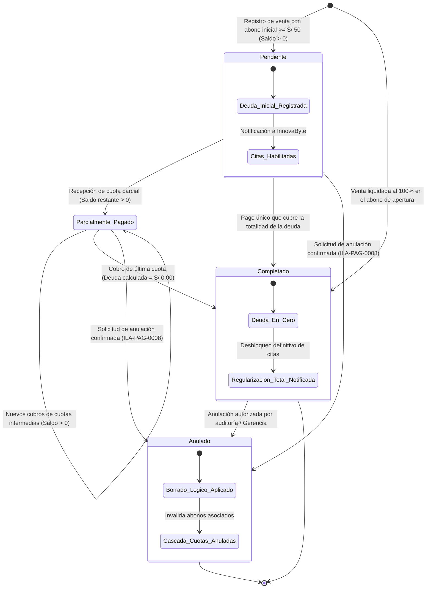
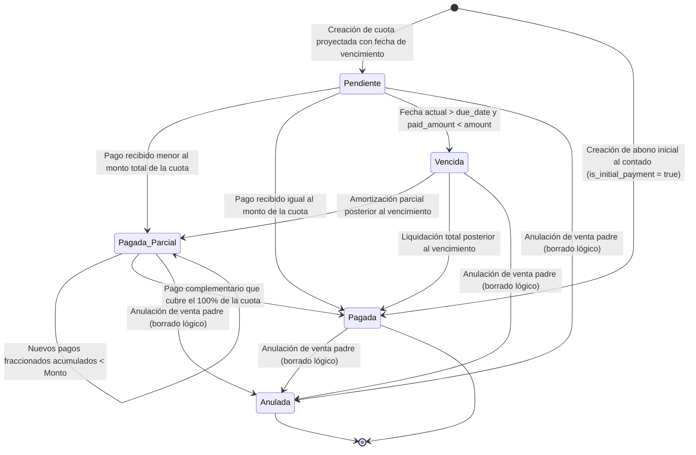
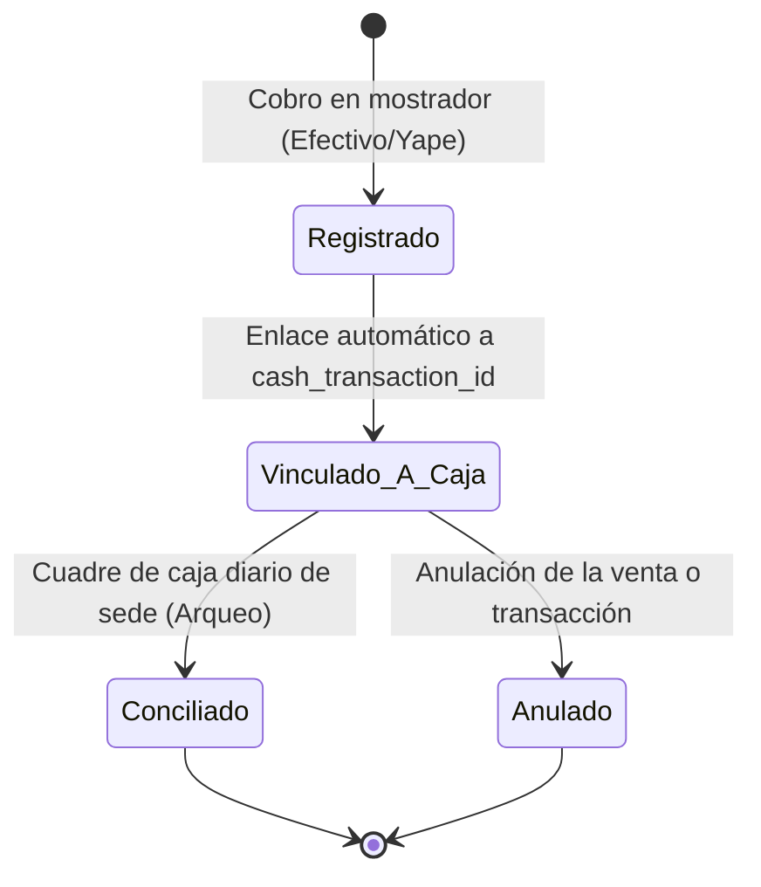

# Diagramas de Estados — Venta de Paquetes y Cuotas (`PackageSale` e `Installment`)

**Dominio:** Entradas por Venta de Paquetes (EDU-0002)  
**Tablas afectadas:** `PackageSale`, `Installment`, `InstallmentPayment` (`payments_db`)  
**Ilaciones asociadas:** ILA-PAG-0005, ILA-PAG-0006, ILA-PAG-0007, ILA-PAG-0008  

---

## 1. Ciclo de Vida y Transiciones de `PackageSale`

Representa la venta global de tratamiento de salud adquirida por un paciente. El estado refleja la situación comercial y financiera de la obligación de pago.

### Tabla de Transiciones de `PackageSale`

| Estado Origen | Evento / Disparador | Condición de Guarda | Estado Destino | Efecto / Acción en el Sistema |
| :--- | :--- | :--- | :--- | :--- |
| `[*]` | Petición POST `ENDPOINT-PAG-0001` | Abono inicial >= S/ 50 y < Total | `Pendiente` | Persiste venta y abono inicial; notifica a `API_InnovaByte`. |
| `[*]` | Petición POST `ENDPOINT-PAG-0001` | Abono inicial == Monto Total | `Completado` | Persiste venta y cuota inicial cancelada; habilita asistencias completas. |
| `Pendiente` | Petición PUT `ENDPOINT-PAG-0007` | Abono cuota > 0 y Saldo > 0 | `Parcialmente_Pagado` | Registra abono en `Installment`, ingreso en caja y desbloqueo de citas. |
| `Parcialmente_Pagado` | Petición PUT `ENDPOINT-PAG-0007` | Saldo restante > 0 | `Parcialmente_Pagado` | Inserta nueva cuota y persiste movimiento en `CashTransaction`. |
| `Pendiente` / `Parcialmente_Pagado` | Petición PUT `ENDPOINT-PAG-0007` | Sumatoria abonos == Monto Total | `Completado` | Regularización completa; notifica cierre de deuda a sistema clínico. |
| `Cualquier estado activo` | Petición DELETE `ENDPOINT-PAG-0008` | Venta no anulada previamente | `Anulado` | Borrado lógico (`status = 'anulado'`) en cascada para venta y cuotas. |

---

## 2. Ciclo de Vida y Transiciones de `Installment` (Cuota)

Modela la obligación o compromiso de pago periódico de una venta.

### Tabla de Transiciones de `Installment`

| Estado Origen | Evento / Disparador | Condición de Guarda | Estado Destino | Acción / Consecuencia |
| :--- | :--- | :--- | :--- | :--- |
| `[*]` | Registro de venta | Cuota diferida futura | `Pendiente` | Genera registro de deuda por cobrar con fecha de vencimiento. |
| `[*]` | Registro de venta | Pago en mostrador | `Pagada` | Marca `is_initial_payment = true`, `paid_amount = amount`. |
| `Pendiente` | Pago en ventanilla | Pago parcial < amount | `Pagada_Parcial` | Actualiza `paid_amount` acumulado; genera `installment_payment`. |
| `Pendiente` / `Pagada_Parcial` | Pago en ventanilla | Pago acumulado == amount | `Pagada` | Salda la cuota; actualiza balance del paquete. |
| `Pendiente` | Verificación cronológica | NOW() > due_date | `Vencida` | Alerta de mora financiera para restricción de citas en admisión. |
| `Vencida` | Pago de regularización | Pago >= saldo de cuota | `Pagada` | Restablece estatus de paciente al día. |
| `Cualquier estado` | Anulación ILA-PAG-0008 | Evento de anulación de venta | `Anulada` | Borrado lógico (`status = 'anulado'`). |

---

## 3. Ciclo de Vida de `InstallmentPayment` (Movimiento de Cobro)

