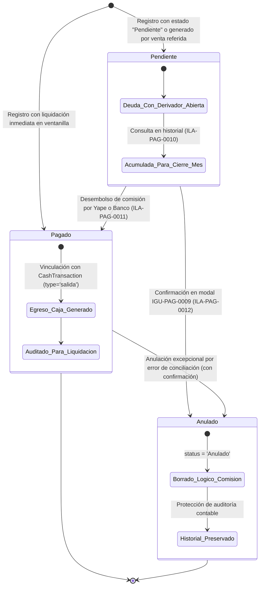

# Diagrama de Estados — Registro de Comisiones Externas (`CommissionRecord`)

**Dominio:** Comisiones Externas (EDU-0005)  
**Tabla afectada:** `CommissionRecord` (`payments_db`)  
**Ilaciones asociadas:** ILA-PAG-0009, ILA-PAG-0010, ILA-PAG-0011, ILA-PAG-0012  

---

## 1. Ciclo de Vida y Transiciones de `CommissionRecord`

Las comisiones externas se generan por derivación de pacientes (Médicos Traumatólogos Aliados o Promotores Externos). Pueden originarse automáticamente en una venta (ILA-PAG-0005) o crearse manualmente en ventanilla (ILA-PAG-0009).

---

## 2. Tabla Formal de Transición de Estados

| Estado Origen | Evento / Disparador | Condición de Guarda | Estado Destino | Acciones Asociadas y Efectos Colaterales |
| :--- | :--- | :--- | :--- | :--- |
| `[*]` | Petición POST `ENDPOINT-PAG-0001` (Venta referida) | `referrer_id` no es nulo | `Pendiente` | Inserta comisión con `status = 'Pendiente'`. `cash_transaction_id` queda en `NULL`. |
| `[*]` | Registro manual en `IGU-PAG-0005` (ILA-PAG-0009) | Usuario selecciona estado "Pendiente" | `Pendiente` | Persiste en `CommissionRecord`; no genera movimiento inmediato de dinero. |
| `[*]` | Registro manual en `IGU-PAG-0005` (ILA-PAG-0009) | Usuario selecciona estado "Pagado" | `Pagado` | Persiste comisión, inserta egreso en `CashTransaction` y registra `payment_date`. |
| `Pendiente` | Actualización en modal `IGU-PAG-0007` (ILA-PAG-0011) | Usuario cambia estado a "Pagado" y confirma en `IGU-PAG-0008` | `Pagado` | Actualiza `status = 'Pagado'`, genera salida en `CashTransaction` e imputa fecha de desembolso. |
| `Pendiente` | Anulación en modal `IGU-PAG-0009` (ILA-PAG-0012) | Confirmación `BTN-0001`, registro no anulado | `Anulado` | Borrado lógico (`status = 'Anulado'`), conservando datos para trazabilidad. |
| `Pendiente` | Anulación de venta origen (ILA-PAG-0008) | Venta anulada por borrado lógico | `Anulado` | Se anula automáticamente en cascada para no generar deuda ficticia al derivador. |
| `Pagado` | Solicitud de anulación administrativa | Confirmación y autorización gerencial | `Anulado` | Cambia estado a `Anulado` y genera ajuste de reversión contable en caja. |

---

## 3. Consideraciones de Negocio e Integración

1. **Datos de Transferencia Automatizados:** Durante la transición a `Pagado`, el sistema consume los datos de solo lectura provistos por el subsistema de Personal (teléfono Yape para Promotores o cuenta bancaria/CCI para Traumatólogos).
2. **Exportación y Cuadre Mensual:** Los registros en estado `Pendiente` y `Pagado` se filtran en `IGU-PAG-0006` y se exportan a Excel (`.xlsx`) sin alterar el estado en la base de datos (operación de solo lectura según ILA-PAG-0010).
