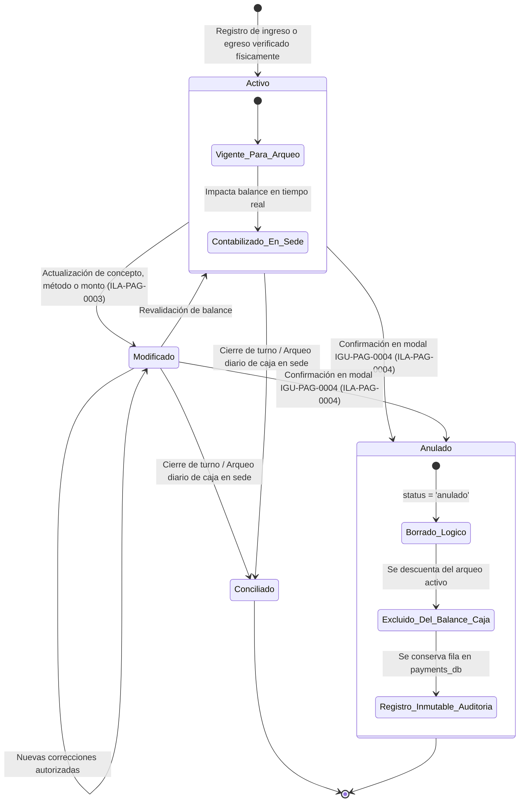
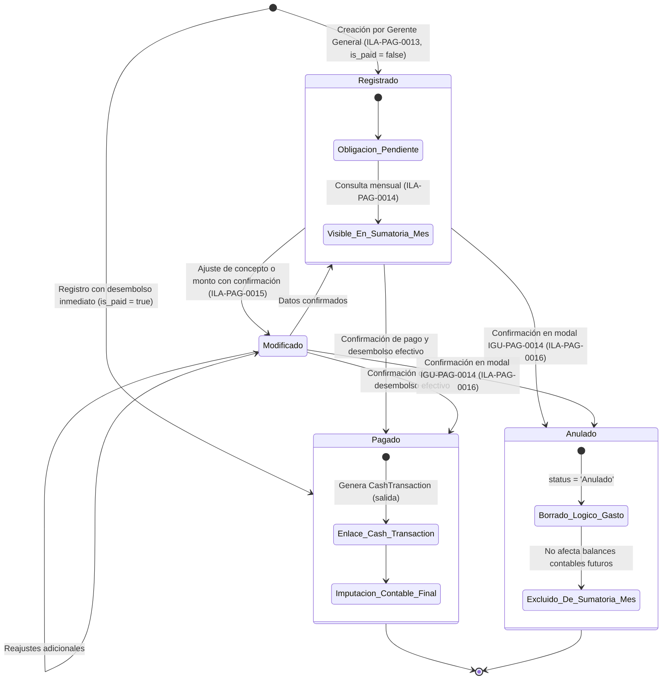

# Diagramas de Estados — Transacciones de Caja y Egresos Fijos (`CashTransaction` y `FixedExpense`)

**Dominios:** Egresos Operativos Diarios (EDU-0001) y Egresos Fijos Mensuales (EDU-0021)  
**Tablas afectadas:** `CashTransaction`, `FixedExpense` (`payments_db`)  
**Ilaciones asociadas:** ILA-PAG-0001, ILA-PAG-0003, ILA-PAG-0004, ILA-PAG-0013, ILA-PAG-0015, ILA-PAG-0016  

---

## 1. Ciclo de Vida y Transiciones de `CashTransaction` (Movimiento de Caja)

`CashTransaction` es el libro mayor transaccional donde convergen todos los ingresos (ventas, cuotas) y salidas (caja chica, comisiones, gastos fijos).

### Tabla de Transiciones de `CashTransaction`

| Estado Origen | Disparador / Evento | Condición de Guarda | Estado Destino | Acción en el Sistema |
| :--- | :--- | :--- | :--- | :--- |
| `[*]` | Registro de salida (ILA-PAG-0001) | Monto > 0, categoría y método válidos | `Activo` | Inserta registro con `type = 'salida'`; resta del saldo de caja de la sede. |
| `[*]` | Venta o cuota (ILA-PAG-0005, 0007) | Pago confirmado en mostrador | `Activo` | Inserta registro con `type = 'ingreso'`; suma al saldo de caja (Efectivo/Yape). |
| `Activo` | Actualizar salida (ILA-PAG-0003) | Monto modificado válido | `Modificado` | Sobreescribe atributos en tabla; recalcula totales para arqueo. |
| `Activo` / `Modificado` | Anular salida (ILA-PAG-0004) | Confirmación `BTN-0016` y estado != 'anulado' | `Anulado` | Borrado lógico (`status = 'anulado'`). El movimiento deja de computarse en el arqueo. |
| `Activo` / `Modificado` | Cierre diario de caja | Validación de arqueo físico vs. sistema | `Conciliado` | Bloquea modificaciones sobre transacciones del turno cerrado. |

---

## 2. Ciclo de Vida y Transiciones de `FixedExpense` (Egreso Fijo Mensual)

Gestiona los compromisos estructurales del negocio (Alquileres, Sueldos, Honorarios, Servicios externos). Operación confidencial y exclusiva de Gerencia General.

### Tabla de Transiciones de `FixedExpense`

| Estado Origen | Disparador / Evento | Condición de Guarda | Estado Destino | Acción en el Sistema |
| :--- | :--- | :--- | :--- | :--- |
| `[*]` | Registro IGU-PAG-0010 (ILA-PAG-0013) | Categoría fija válida y monto > 0 | `Registrado` | Inserta egreso fijo en `FixedExpense`; computa en sumatoria de `IGU-PAG-0011`. |
| `Registrado` | Edición IGU-PAG-0012 (ILA-PAG-0015) | Confirmación en `IGU-PAG-0013`, monto > 0 | `Modificado` | Actualiza descripción/monto; recalcula sumatoria automática de solo lectura. |
| `Registrado` / `Modificado` | Desembolso de fondos | Autorización y pago realizado | `Pagado` | Asigna `is_paid = true`, `payment_date = NOW()` y vincula a `cash_transaction_id`. |
| `Registrado` / `Modificado` | Anulación IGU-PAG-0014 (ILA-PAG-0016) | Confirmación `BTN-0001` y estado != 'Anulado' | `Anulado` | Borrado lógico (`status = 'Anulado'`); se excluye de la sumatoria total mensual. |
