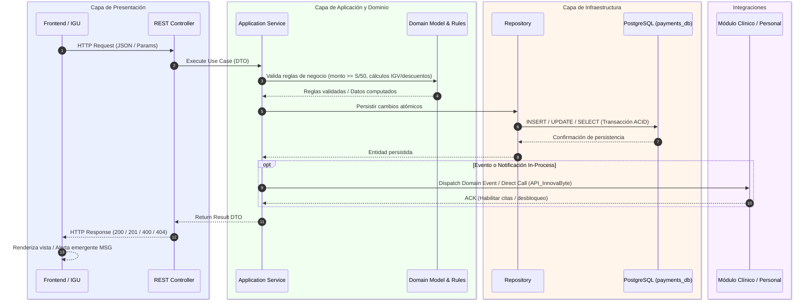
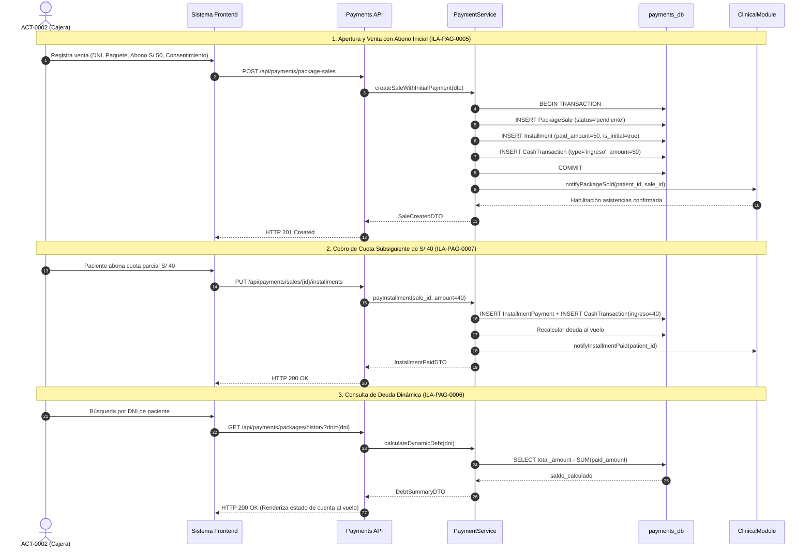

# Diagramas de Secuencia Consolidados — Servicio de Pagos (`payments-service`)

Este documento consolida la arquitectura dinámica y las secuencias de interacción para el módulo de pagos, cubriendo los 4 dominios funcionales y los 16 requisitos del catálogo formal (**ILA-PAG-0001** a **ILA-PAG-0016**).

---

## Estructura de Documentación

Los diagramas detallados por caso de uso se encuentran modularizados en los siguientes artefactos:

| Archivo | Dominio Operativo | Requisitos Cubiertos | Actores Principales |
| :--- | :--- | :--- | :--- |
| [seq-01-egresos-operativos.md](file:///c:/Users/luisg/OneDrive/Documentos/Universidad/8vo/Arquitectura/architecture-docs/services/payments/diagrama%20de%20secuencias/seq-01-egresos-operativos.md) | Egresos Operativos Diarios | ILA-PAG-0001 a ILA-PAG-0004 | ACT-0001 (Gerente), ACT-0002 (Cajera) |
| [seq-02-entradas-ventas-paquetes.md](file:///c:/Users/luisg/OneDrive/Documentos/Universidad/8vo/Arquitectura/architecture-docs/services/payments/diagrama%20de%20secuencias/seq-02-entradas-ventas-paquetes.md) | Entradas por Ventas y Cuotas | ILA-PAG-0005 a ILA-PAG-0008 | ACT-0002, ORG-0003 (Frontend Clínico), API_InnovaByte |
| [seq-03-comisiones-externas.md](file:///c:/Users/luisg/OneDrive/Documentos/Universidad/8vo/Arquitectura/architecture-docs/services/payments/diagrama%20de%20secuencias/seq-03-comisiones-externas.md) | Comisiones Externas | ILA-PAG-0009 a ILA-PAG-0012 | ACT-0001, ACT-0002, Módulo de Personal |
| [seq-04-egresos-fijos-mensuales.md](file:///c:/Users/luisg/OneDrive/Documentos/Universidad/8vo/Arquitectura/architecture-docs/services/payments/diagrama%20de%20secuencias/seq-04-egresos-fijos-mensuales.md) | Egresos Fijos Mensuales | ILA-PAG-0013 a ILA-PAG-0016 | ACT-0001 (Gerente General) |

---

## 1. Patrón Arquitectónico de Interacción Dinámica

En concordancia con los registros de decisiones arquitectónicas **ADR-0001** (Clean Architecture en Monolito Modular) y **ADR-0004** (Comunicación In-Process), el servicio de pagos organiza sus llamadas dinámicas en 4 capas:

---

## 2. Secuencia Maestra End-to-End: Venta de Paquete, Cobro de Cuota y Cierre de Caja

