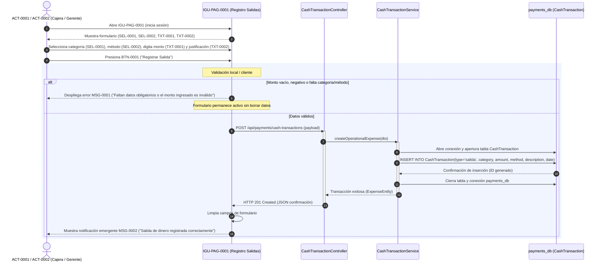
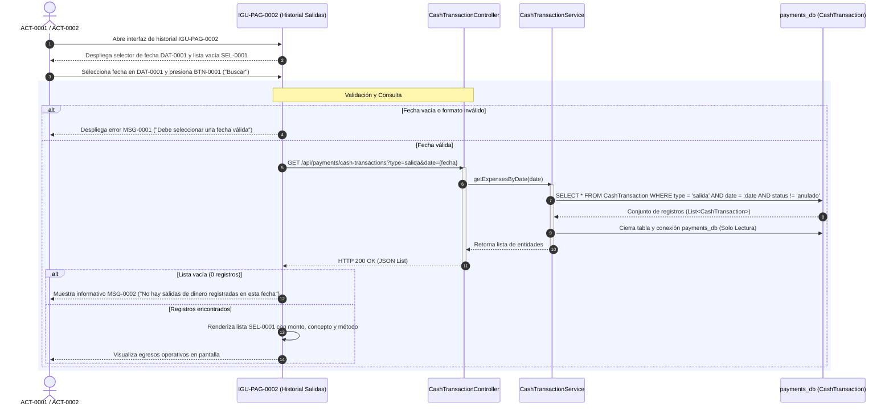
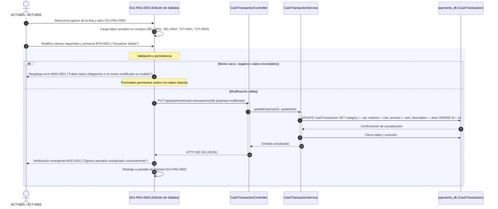
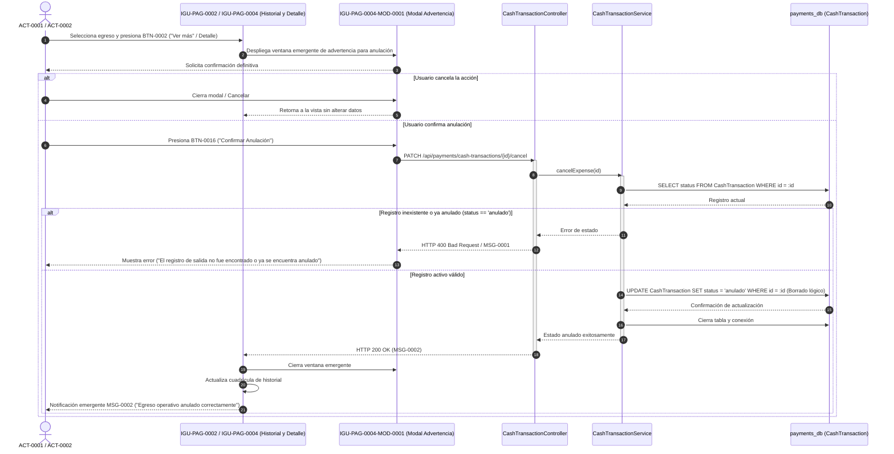

# Diagramas de Secuencia — Egresos Operativos Diarios

**Educción:** EDU-0001  
**Tabla afectada:** `CashTransaction` (`payments_db`)  
**Actores:** ACT-0001 (Gerente General), ACT-0002 (Cajera)  
**Ilaciones cubiertas:** ILA-PAG-0001, ILA-PAG-0002, ILA-PAG-0003, ILA-PAG-0004  

---

## 1. Crear Egreso Operativo Diario (ILA-PAG-0001 v02.04)

Describe la interacción desde que el usuario completa el formulario de salida hasta la persistencia física en `CashTransaction` con `type = 'salida'`.

---

## 2. Consultar Historial de Egresos Operativos (ILA-PAG-0002 v03.00)

Operación estricta de solo lectura filtrando por fecha sobre `CashTransaction`.

---

## 3. Actualizar Registro de Egreso Operativo (ILA-PAG-0003 v03.00)

Edición de atributos de una salida registrada previamente en el sistema.

---

## 4. Anular Registro de Egreso Operativo (ILA-PAG-0004 v03.01)

Mitigación de riesgos operativos mediante ventana modal de advertencia y borrado lógico.

