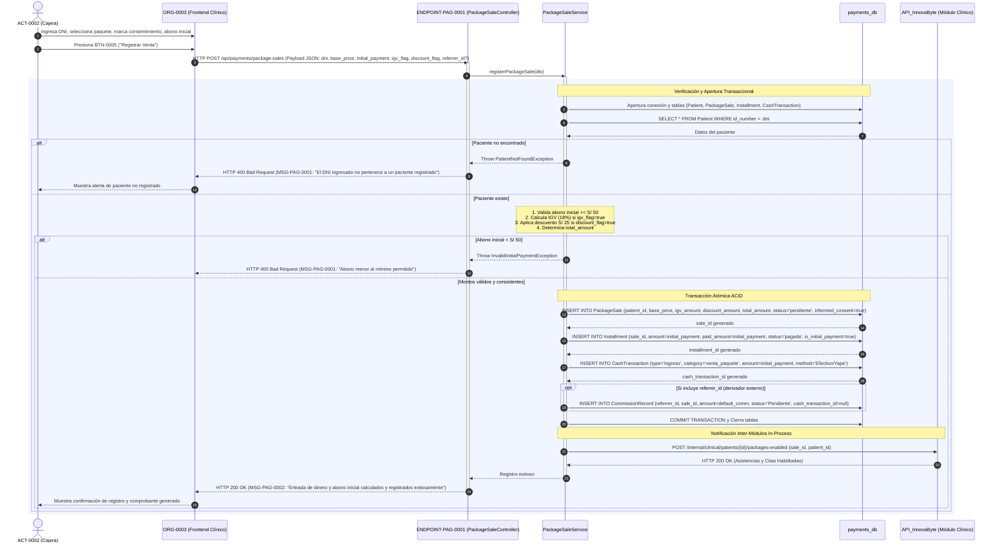
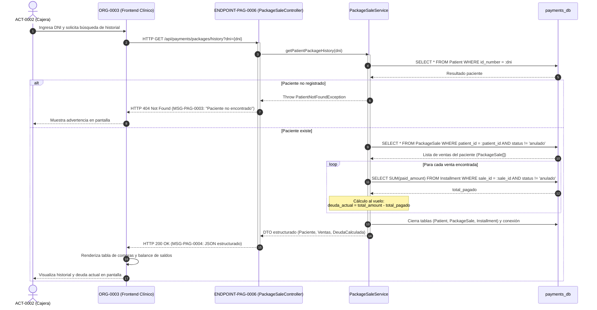
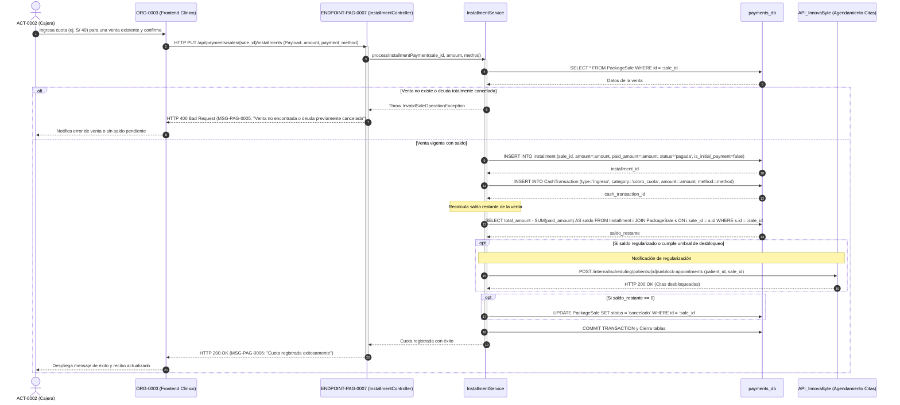
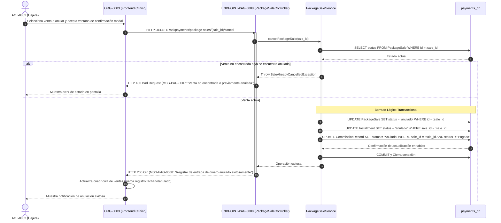

# Diagramas de Secuencia — Entradas por Venta de Paquetes y Cuotas

**Educción:** EDU-0002  
**Tablas afectadas:** `Patient`, `PackageSale`, `Installment`, `InstallmentPayment`, `CashTransaction`, `CommissionRecord` (`payments_db`)  
**Actores:** ACT-0002 (Cajera), ORG-0003 (Sistema Frontend Clínico InnovaByte), `API_InnovaByte` (Módulo Clínico)  
**Ilaciones cubiertas:** ILA-PAG-0005, ILA-PAG-0006, ILA-PAG-0007, ILA-PAG-0008  

---

## 1. Crear Registro de Entrada de Dinero y Venta de Paquete (ILA-PAG-0005 v02.04)

Flujo de integración backend donde se recibe la venta desde el frontend clínico (ORG-0003), se recalculan las fórmulas financieras internamente, se persiste atómicamente en múltiples tablas y se notifica al módulo clínico para habilitar citas.

---

## 2. Consultar Historial de Paquetes y Deuda Dinámica por DNI (ILA-PAG-0006 v02.05)

Operación de lectura backend donde la deuda no se lee de una columna estática, sino que se calcula en tiempo real restando los abonos registrados en `Installment` al `total_amount` de `PackageSale`.

---

## 3. Actualizar Registro de Entrada: Cobro de Cuota y Regularización (ILA-PAG-0007 v02.01)

Registro de pagos parciales posteriores (ej. S/ 40) que amortizan la deuda de una venta y desbloquean reservas de citas en el sistema clínico.

---

## 4. Anular Registro de Entrada de Dinero (ILA-PAG-0008 v02.00)

Borrado lógico en cascada sobre la venta y sus correspondientes cuotas asociadas.

