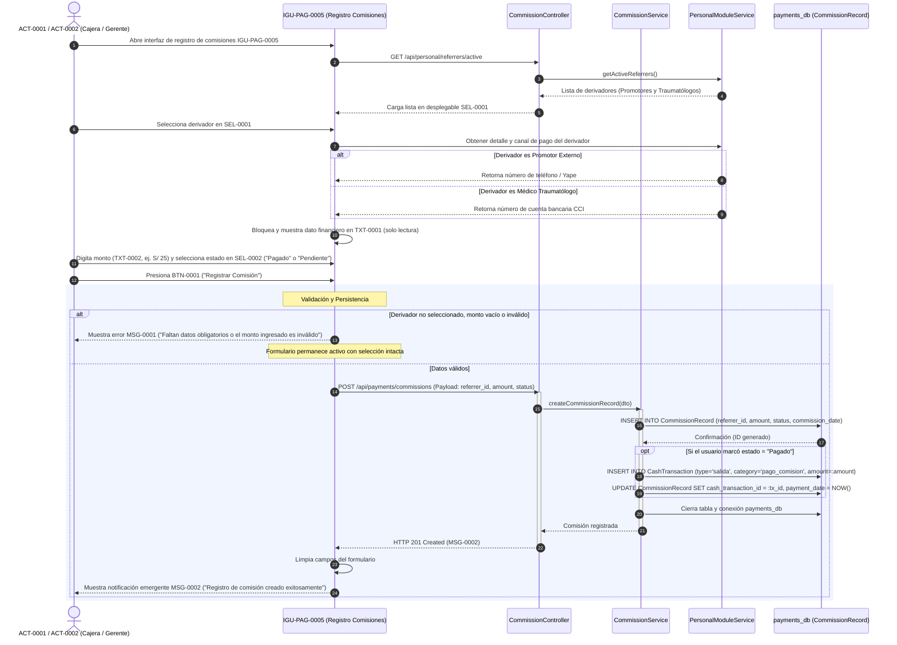
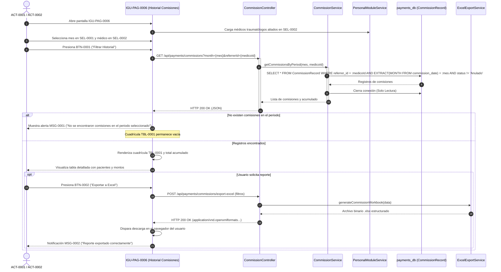
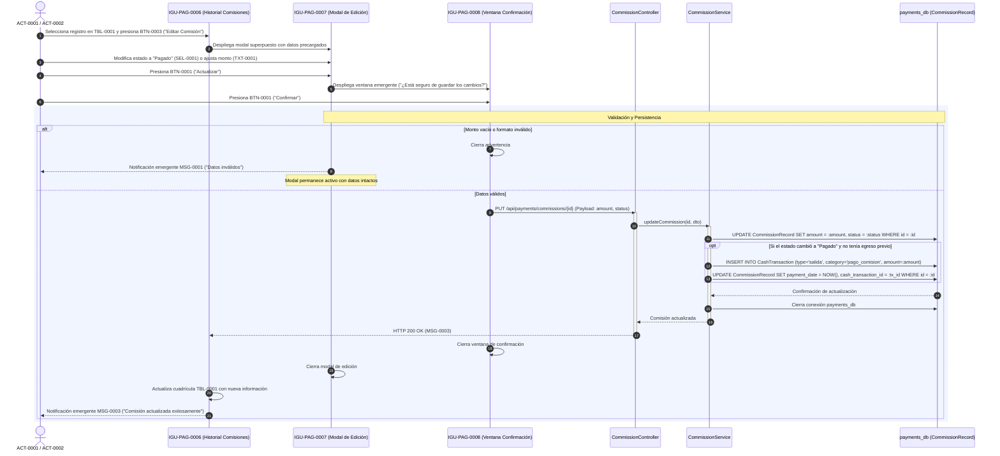
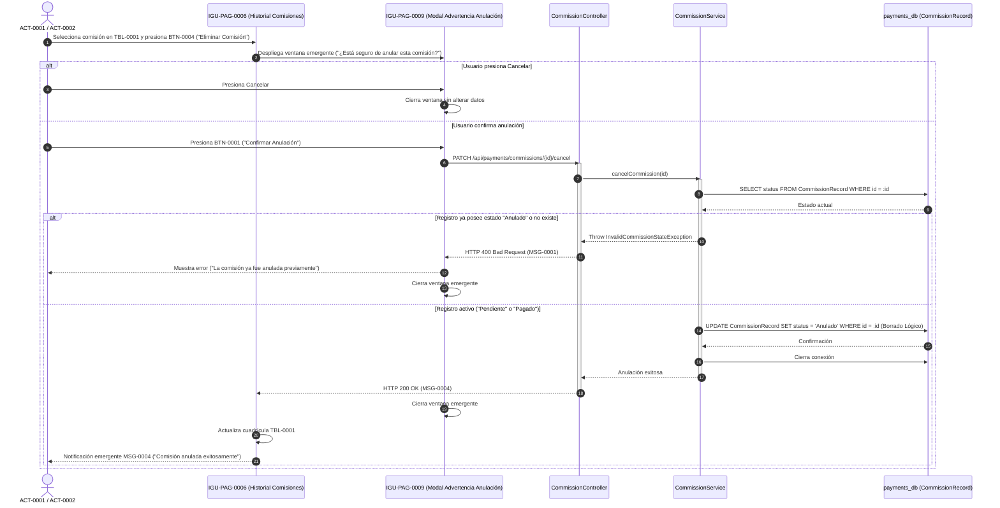

# Diagramas de Secuencia — Comisiones Externas

**Educción:** EDU-0005  
**Tabla afectada:** `CommissionRecord` (`payments_db`) e integración de lectura con `personal_db` (Subsistema de Personal)  
**Actores:** ACT-0001 (Gerente General), ACT-0002 (Cajera)  
**Ilaciones cubiertas:** ILA-PAG-0009, ILA-PAG-0010, ILA-PAG-0011, ILA-PAG-0012  

---

## 1. Crear Registro de Pago o Deuda de Comisión Externa (ILA-PAG-0009 v03.00)

Describe la interacción con la interfaz IGU-PAG-0005, consultando al módulo de Personal para autocompletar los datos de transferencia del referidor.

---

## 2. Consultar Historial de Comisiones y Exportar Reporte a Excel (ILA-PAG-0010 v02.00)

Filtro mensual de comisiones por médico traumatólogo con generación y descarga local de archivo `.xlsx`.

---

## 3. Actualizar Estado o Monto de Comisión Externa (ILA-PAG-0011 v02.00)

Edición de comisión en ventana modal con ventana previa de confirmación para mitigación de riesgos financieros.

---

## 4. Anular Registro de Comisión Externa (ILA-PAG-0012 v02.00)

Borrado lógico con advertencia estricta en IGU-PAG-0009.

