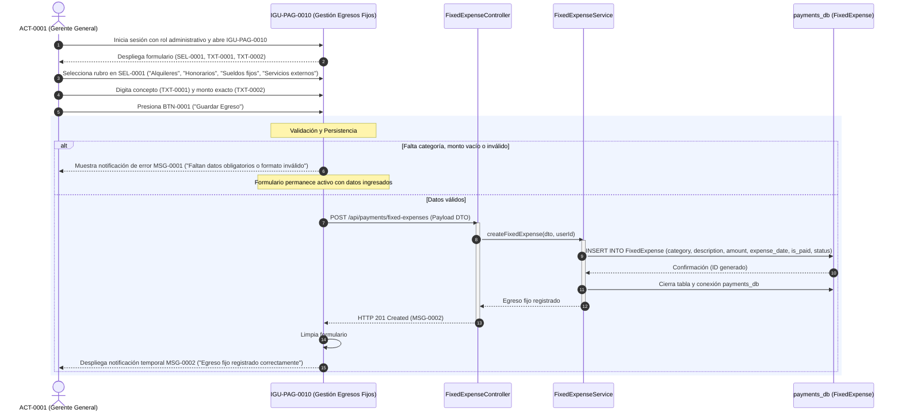
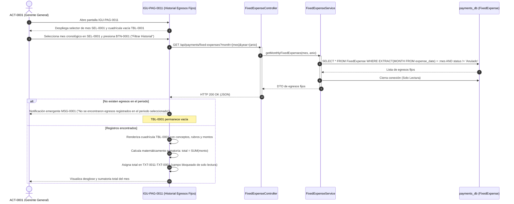
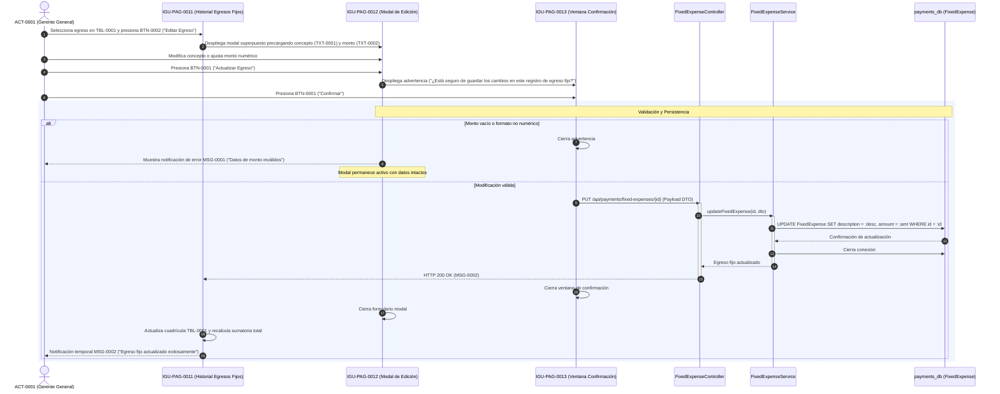
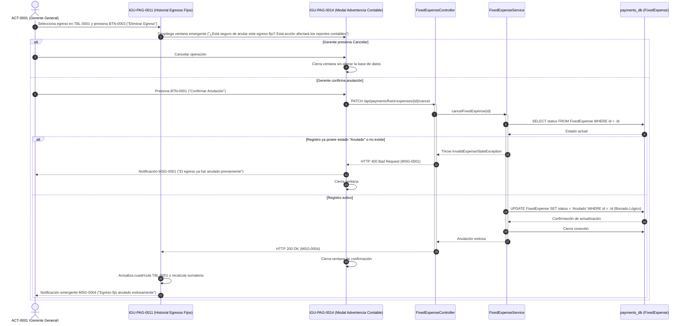

# Diagramas de Secuencia — Egresos Fijos Mensuales

**Educción:** EDU-0021  
**Tabla afectada:** `FixedExpense` (`payments_db`)  
**Actores:** ACT-0001 (Gerente General) — Operación Confidencial  
**Ilaciones cubiertas:** ILA-PAG-0013, ILA-PAG-0014, ILA-PAG-0015, ILA-PAG-0016  

---

## 1. Crear Registro de Pago de Egreso Fijo (ILA-PAG-0013 v03.00)

Registro de rubros fijos estructurales por parte de la Gerencia General (alquileres, sueldos fijos, honorarios profesionales, servicios externos).

---

## 2. Consultar Historial de Egresos Fijos y Sumatoria (ILA-PAG-0014 v02.00)

Consulta mensual confidencial que procesa la cuadrícula de datos y computa de forma matemática automática la sumatoria total en un campo de solo lectura.

---

## 3. Actualizar Registro de Egreso Fijo (ILA-PAG-0015 v02.00)

Edición de egresos por reajustes salariales o correcciones de digitación con ventana modal preventiva.

---

## 4. Anular Registro de Egreso Fijo (ILA-PAG-0016 v02.00)

Borrado lógico con ventana de advertencia de impacto contable en IGU-PAG-0014.

