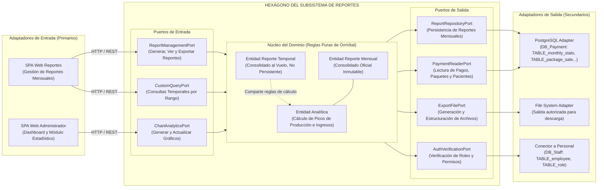
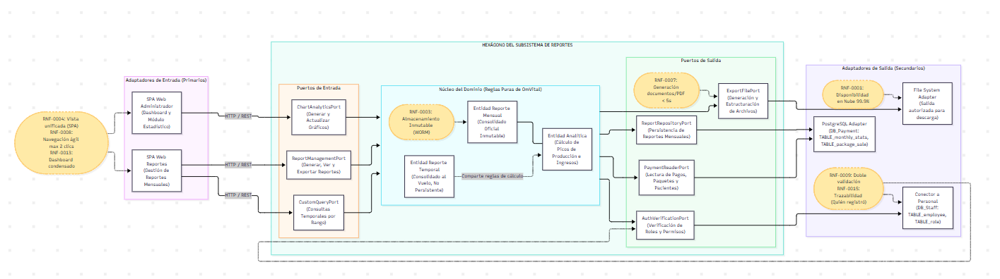

# Resumen y Arquitectura Genérica del Servicio de Reportes

El servicio de reportes administra el análisis matemático, la consolidación visual y la exportación de la información financiera y operativa de la clínica. Trabaja consultando principalmente la base de datos **DB_payment_service_db** y verifica autorizaciones en **DB_staff_db**. Su operación cubre reportes mensuales oficiales, consultas personalizadas temporales y el análisis gráfico de picos de producción. Lee información de las tablas **PackageSale**, **Patient**, **CommissionRecord**, **FixedExpense**, **CashTransaction**, y escribe de forma restrictiva únicamente en **TABLE_monthly_stats**.

La lógica general se apoya en cinco principios arquitectónicos y de negocio:

- **Inmutabilidad histórica:** los reportes oficiales mensuales generados no pueden ser actualizados ni eliminados bajo ninguna circunstancia, protegiendo la auditoría contable y tributaria.
- **Efimeridad de datos:** las consultas personalizadas y gráficos estadísticos se calculan "al vuelo" en la memoria RAM y desaparecen al finalizar la sesión, sin almacenarse en la base de datos.
- **Validación estricta:** se verifican rangos lógicos de fechas (fecha inicio no puede ser mayor a fecha fin) y se evita la duplicidad de consolidaciones mensuales.
- **Aislamiento de lectura (Read-Only):** el servicio jamás modifica los datos transaccionales (facturas, pagos, pacientes); solo los lee para extraer los indicadores.
- **Control de acceso:** todas las operaciones son exclusivas del Administrador (ACT-0001), verificando previamente sus credenciales y permisos.

---

## 1. Arquitectura Genérica del Sistema

La solución utiliza una **Arquitectura Heterogénea**, combinando un estilo **Distribuido Cliente-Servidor** (para separar las interfaces SPA Web del backend) con un diseño interno **Orientado a Componentes y Capas** implementado mediante el patrón de **Arquitectura Hexagonal (Puertos y Adaptadores)**. 

Este enfoque promueve la alta cohesión y el bajo acoplamiento: el "Núcleo del Dominio" (donde residen las reglas y algoritmos de OmVital) está totalmente aislado de las tecnologías externas (PostgreSQL, File Systems). Las entidades solo se comunican con el exterior mediante interfaces estandarizadas (Puertos de Entrada/Salida).

---
## 2. Reportes Administrativos Mensuales

Consolidados oficiales e inmutables que resumen la actividad contable de un mes calendario. Se gestionan mediante la entidad vinculada a la tabla **TABLE_monthly_stats**.

### Generar reporte mensual

- El Administrador inicia sesión y abre el módulo de reportes mensuales.
- Selecciona el botón "Generar Reporte Mensual".
- El sistema identifica automáticamente el mes y año calendario a consolidar.
- Validaciones:
  - Se consulta si ya existe un registro en **TABLE_monthly_stats** para ese mismo mes y año.
  - Si ya existe, se bloquea la operación y se muestra el error: “El reporte mensual del periodo ya fue generado”.
  - No se altera la base de datos.
- Si es válido (no existe un reporte previo):
  - El backend lee de forma masiva los datos de **PackageSale**, **Patient**, **CommissionRecord**, **FixedExpense** y **CashTransaction**.
  - Calcula matemáticamente el Ingreso Bruto, IGV, Descuentos, Comisiones pagadas, Gastos Fijos, Ingreso Neto y determina el "Día Pico" de producción.
  - Se persiste atómicamente el nuevo registro en **TABLE_monthly_stats**.
  - Se muestra confirmación: “Reporte mensual administrativo generado correctamente”.
- Postcondición: el consolidado queda guardado permanentemente de forma inmutable. La lista de reportes en la interfaz se actualiza.

### Leer detalle de reporte mensual

- El Administrador abre la lista de reportes mensuales almacenados.
- Selecciona un reporte específico de la lista.
- Validaciones:
  - Se verifica que el identificador del reporte no sea nulo.
  - Si no es válido, se detiene el proceso.
- Si es válido:
  - Se consulta **TABLE_monthly_stats** para extraer la información.
  - Se renderizan en pantalla los totales (pacientes, paquetes vendidos, ingreso bruto, ingreso neto, descuentos, etc.).
- Postcondición: operación de solo lectura; no se modifica ninguna base de datos.

### Exportar reporte mensual

- Desde la vista de detalle, el Administrador presiona “Exportar Reporte”.
- Validaciones:
  - Se verifica que los datos del reporte existan y sean consistentes.
  - Si hay un fallo en la lectura, se muestra: “Ocurrió un error al exportar el reporte”.
- Si todo es válido:
  - El sistema estructura la información del reporte en un formato de archivo autorizado por el sistema (ej. Excel/PDF).
  - Se habilita y dispara la descarga del archivo en el navegador del administrador.
  - Se muestra: “Reporte exportado correctamente”.
- Postcondición: archivo descargado en el equipo local del administrador. El registro original en base de datos permanece intacto.

---

## 3. Reportes Administrativos Personalizados

Operaciones efímeras para consultas de auditoría interna sobre un rango de fechas libre. Estos reportes no tienen representación física en la base de datos.

### Generar y visualizar reporte personalizado

- El Administrador ingresa al submódulo "Reporte personalizado".
- Ingresa una "Fecha Inicial" y una "Fecha Final".
- Presiona "Generar Reporte Personalizado".
- Validaciones:
  - Se verifica cronología: si la fecha inicial es mayor a la final, se muestra el error: "El rango de fechas es inválido".
  - Se detiene la generación y no se satura la memoria.
- Si el rango es válido:
  - El sistema consulta los movimientos de caja y ventas (**CashTransaction**, **PackageSale**, **Patient**) de ese periodo específico.
  - Calcula dinámicamente los ingresos y volúmenes de venta.
  - Renderiza el resultado en el área visual de la interfaz.
  - Muestra un mensaje temporal: "Reporte personalizado generado correctamente".
- Postcondición: la información vive temporalmente en la interfaz del Administrador. Por regla de negocio y diseño arquitectónico, la entidad encargada no tiene conexión al puerto de escritura, por lo que **no se almacena** en **TABLE_monthly_stats**.

### Descartar reporte temporal (Nueva Consulta / Finalizar)

- El Administrador revisa la información en pantalla.
- Presiona "Nueva Consulta" (para cambiar fechas) o "Finalizar Consulta" (para salir).
- El sistema libera dinámicamente los recursos de memoria RAM asignados a ese reporte.
- El área visual de resultados se limpia.
- Postcondición: la información consolidada desaparece del sistema sin dejar registro histórico (cumpliendo el principio de privacidad de consultas temporales).

---

## 4. Gestión de Estadísticas

Módulo de análisis visual y matemático enfocado en la estacionalidad y rendimiento gerencial. Genera representaciones gráficas interactivas.

### Generar gráfico estadístico de rendimiento

- El Administrador entra al "Módulo de Estadísticas".
- Ingresa un rango de fechas y selecciona el "Tipo de gráfica" (Barra, Torta, etc.).
- Presiona "Generar análisis visual".
- Validaciones:
  - Si el rango de fechas es ilógico (inicio > fin), se muestra: "El rango de fechas es inválido".
- Si es válido:
  - Se extraen los datos estadísticos y se ejecutan los algoritmos para identificar picos de producción (meses con más ingresos/pacientes).
  - Se construye y renderiza el gráfico en el componente visual del panel.
  - Se muestra: "Análisis visual generado correctamente".
- Postcondición: el gráfico es visible en pantalla. No se alteran los datos originales en la base de datos.

### Actualizar parámetros del gráfico

- Con un gráfico ya generado en pantalla, el Administrador modifica las fechas o el tipo de gráfica en los selectores.
- Presiona "Actualizar gráfico".
- Validaciones:
  - Se re-validan los rangos lógicos de las nuevas fechas.
- Si es válido:
  - El motor matemático recalcula los indicadores y re-identifica los nuevos picos de producción.
  - El gráfico en pantalla cambia dinámicamente su forma o datos.
  - Se muestra: "Gráfico actualizado correctamente".
- Postcondición: vista refrescada. Los parámetros utilizados se guardan temporalmente en la sesión activa del usuario para agilizar consultas.

### Eliminar gráfico del panel

- El Administrador presiona "Eliminar gráfico".
- Validaciones:
  - Verifica que exista un gráfico cargado en la vista.
- Si es válido:
  - Se ejecuta un limpiado (clear) del componente visual.
  - Se liberan los recursos de memoria asociados a la representación de la interfaz.
  - Se muestra: "El gráfico fue eliminado correctamente".
- Postcondición: el panel queda en blanco, listo para un nuevo análisis. La eliminación es puramente visual; ningún dato administrativo fue borrado de la base de datos.

---

## 5. Persistencia y efectos en la base de datos

El Servicio de Reportes restringe enormemente sus permisos sobre la base de datos **DB_payment_service_db** y **DB_staff_db**:

- **TABLE_monthly_stats:** es la única tabla donde el servicio tiene permisos de escritura (INSERT), exclusivamente durante la generación del reporte oficial mensual.
- **PackageSale, Patient, CommissionRecord, FixedExpense, CashTransaction:** tienen permisos estrictos de **SOLO LECTURA (Read-Only)**. El servicio extrae datos para calcular sumatorias, pero es arquitectónicamente incapaz de modificar un pago o una venta.
- **Ausencia de UPDATE/DELETE:** por mandato de las reglas de negocio (EDU-0007), no existe ningún flujo en el servicio que ejecute actualizaciones o borrados lógicos/físicos sobre la información almacenada.

---

## 6. Controles de seguridad y mitigación de riesgos

- **Inmutabilidad obligatoria:** la inexistencia de funciones de edición para los reportes mensuales elimina el riesgo de alteración de auditorías financieras o fraude.
- **Protección de memoria (Memory Leaks):** al finalizar consultas temporales o eliminar gráficos, se ejecuta explícitamente la liberación de variables y memoria RAM (`free_memory()`), evitando saturación por consultas grandes.
- **Cierre de transacciones y tablas:** después de cada cálculo matemático pesado, el sistema garantiza el cierre de las tablas y desconexión segura de la base de datos.
- **Validación cruzada de roles:** antes de cualquier cálculo estadístico masivo, el sistema pregunta a **DB_staff_db** para cerciorarse de que la sesión activa pertenezca a un usuario con rol de Administrador, bloqueando intentos de acceso por fuerza bruta.